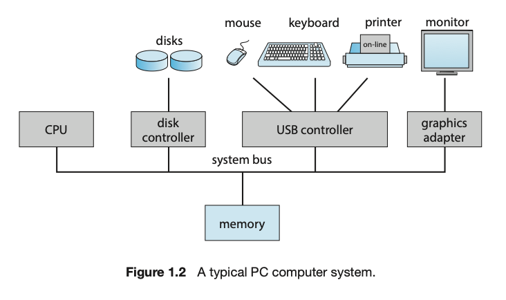

# Operating System Concepts

TENTH EDITION

ABRAHAM SILBERSCHATZ, PETER BAER HALVIN, GREG GAGNE

---

# Chapter1 Introduction

---

## 1.1 What Operating Systems Do

- The four components of a computer system

  - **hardware**
    - provides the basic computing resources for the system.
  - operating system
  - **application programs**
    - define the ways in which thses resources are used to solve users' computing problems.
  - user

- An operating system simply provides an **environment** within which other programs can do useful work.

---

## 1.1 What Operating Systems Do

## 

---

### 1.1.1 User View

The user's view of a computer varies depending on the interface used, with desktop and laptop systems designed for one user to maximize their work/play, mobile devices like smartphones and tablets featuring touch screens and voice recognition, and embedded computers in home devices and automobiles having little to no user view.

데스크톱 및 노트북 시스템은 한 명의 사용자가 업무/놀이를 극대화할 수 있도록 설계된 반면, 터치스크린과 음성 인식 기능을 갖춘 스마트폰 및 태블릿과 같은 모바일 디바이스, 가정용 기기 및 자동차의 임베디드 컴퓨터는 사용자 보기가 거의 또는 전혀 없는 등 사용하는 인터페이스에 따라 컴퓨터의 사용자 보기가 달라집니다.

---

### 1.1.2 System View

The operating system is viewed as a **resource allocator** from the computer's point of view, managing resources such as CPU time, memory space, storage space, and I/O devices, and **controlling user programs** and I/O devices to prevent errors and improper use of the computer.

운영체제는 컴퓨터의 관점에서 볼 때 CPU 시간, 메모리 공간, 저장 공간, 입출력 장치 등의 자원을 관리하고 사용자 프로그램 및 입출력 장치를 제어하여 컴퓨터의 오류 및 부적절한 사용을 방지하는 자원 할당자로 볼 수 있습니다.

---

### 1.1.3 Defining Operating Systems

The term "operating system" covers various roles and functions due to the myriad designs and uses of computers, and although there is no universally accepted definition of an operating system, it is considered to be the **kernel**, middleware frameworks, and **system programs** that aid in managing the system while it is running.

"운영 체제"라는 용어는 컴퓨터의 무수한 설계와 사용으로 인해 다양한 역할과 기능을 포함하며, 운영 체제에 대한 보편적으로 인정되는 정의는 없지만 커널, 미들웨어 프레임워크 및 시스템이 실행되는 동안 시스템을 관리하는 데 도움이 되는 시스템 프로그램으로 간주됩니다.

---

### WHY STUDY OPERATING SYSTEM?

Studying operating systems is important because almost all code runs on top of an operating system, making knowledge of how they work crucial for proper, efficient, effective, and secure programming, as understanding their fundamentals and how they drive computer hardware is essential for programmers and users alike.

거의 모든 코드가 운영 체제 위에서 실행되므로 운영 체제에 대한 지식은 적절하고 효율적이며 효과적이고 안전한 프로그래밍을 위해 매우 중요하며, 운영 체제의 기본 사항과 컴퓨터 하드웨어를 구동하는 방식을 이해하는 것은 프로그래머와 사용자 모두에게 필수적이기 때문입니다.

---

## 1.2 Computer-System Organization

A modern general-purpose computer system includes CPUs and device controllers connected through a common bus, with device controllers responsible for specific types of devices and maintaining local buffer storage and special-purpose registers, and operating systems having a device driver for each controller to provide a uniform interface to the device. The system operates through interrupts, storage structure, and I/O structure.

최신 범용 컴퓨터 시스템은 공통 버스를 통해 연결된 CPU와 장치 컨트롤러를 포함하며, 장치 컨트롤러는 특정 유형의 장치를 담당하고 로컬 버퍼 스토리지 및 특수 목적 레지스터를 유지 관리하며, 운영 체제는 각 컨트롤러에 대한 장치 드라이버를 통해 장치에 균일한 인터페이스를 제공합니다. 시스템은 인터럽트, 스토리지 구조, 입출력 구조를 통해 작동합니다.

---

## 1.2 Computer-System Organization

---

### 1.2.1 Interrupts

During a typical computer operation involving I/O, the device driver loads the appropriate registers in the device controller, which starts the data transfer and informs the device driver of its completion through an interrupt, which is a mechanism used by the controller to alert the CPU to events that require attention.

I/O와 관련된 일반적인 컴퓨터 작업 중에 장치 드라이버는 장치 컨트롤러에 적절한 레지스터를 로드하여 데이터 전송을 시작하고 컨트롤러가 주의가 필요한 이벤트를 CPU에 알리기 위해 사용하는 메커니즘인 인터럽트를 통해 완료를 장치 드라이버에 알립니다.

---

#### 1.2.1.1 Overview

Interrupts are signals sent by hardware to the CPU through the system bus to alert the CPU of events that require attention, with the CPU immediately transferring execution to a fixed location to run the interrupt service routine before resuming the interrupted computation; a table of pointers to interrupt routines is used to provide necessary speed and the interrupt architecture must save the state information of whatever was interrupted so that it can restore it after servicing the interrupt.

인터럽트는 하드웨어가 시스템 버스를 통해 CPU에 보내는 신호로, 주의가 필요한 이벤트를 CPU에 알리기 위해 CPU는 즉시 실행을 고정된 위치로 이전하여 중단된 연산을 재개하기 전에 인터럽트 서비스 루틴을 실행합니다. 인터럽트 루틴에 대한 포인터 테이블은 필요한 속도를 제공하기 위해 사용되며 인터럽트 아키텍처는 중단된 상태의 정보를 저장하여 인터럽트 서비스 후 복원할 수 있도록 해야 합니다.

---

---

#### 1.2.1.2 Implementation

The interrupt mechanism in computer systems works by using interrupt request lines and interrupt vectors to handle asynchronous events such as device-generated interrupts, with a system of interrupt priorities allowing for the handling of the most urgent work first, and interrupt chaining used to deal with large numbers of interrupt handlers.

컴퓨터 시스템의 인터럽트 메커니즘은 인터럽트 요청 라인과 인터럽트 벡터를 사용하여 장치 생성 인터럽트와 같은 비동기 이벤트를 처리하는 방식으로 작동하며, 가장 긴급한 작업을 먼저 처리할 수 있는 인터럽트 우선순위 시스템과 많은 수의 인터럽트 처리기를 처리하는 데 사용되는 인터럽트 연쇄를 사용합니다.

---

---

---

### 1.2.2 Storage Structure

A computer system requires memory to store programs and data. Main memory is volatile and usually implemented in DRAM. For permanent storage, computer systems use secondary storage devices like HDDs and NVM devices, which are nonvolatile. Secondary storage is slower than main memory, so managing it is crucial. A hierarchy of storage systems exists, with faster and smaller memory closer to the CPU. Electrical storage, like flash memory, is faster but more expensive than mechanical storage, like HDDs. A complete storage system should balance all factors and use caching to improve performance.

컴퓨터 시스템에는 프로그램과 데이터를 저장하기 위한 메모리가 필요합니다. 주 메모리는 휘발성이며 일반적으로 DRAM으로 구현됩니다. 영구 저장을 위해 컴퓨터 시스템은 비휘발성인 HDD 및 NVM 장치와 같은 보조 저장 장치를 사용합니다. 보조 스토리지는 주 메모리보다 속도가 느리기 때문에 관리가 중요합니다. 스토리지 시스템의 계층 구조가 존재하며, 더 빠르고 작은 메모리가 CPU에 더 가깝습니다. 플래시 메모리와 같은 전기식 스토리지는 HDD와 같은 기계식 스토리지보다 빠르지만 더 비쌉니다. 완벽한 스토리지 시스템은 모든 요소의 균형을 맞추고 캐싱을 사용하여 성능을 개선해야 합니다.

---

#### STORAGE DEFINITIONS AND NOTATION

The basic unit of computer storage is a bit, which can have a value of 0 or 1. Most computer storage is based on collections of bits, with a byte being the smallest convenient chunk of storage, consisting of 8 bits. A word is a computer architecture's native unit of data, made up of one or more bytes. Computer storage is generally measured and manipulated in bytes and collections of bytes, with larger units being kilobytes, megabytes, gigabytes, terabytes, and petabytes. Computer manufacturers may round off these numbers, and networking measurements are an exception, as they are given in bits.

컴퓨터 저장소의 기본 단위는 비트이며 0 또는 1의 값을 가질 수 있습니다. 대부분의 컴퓨터 저장소는 비트 모음을 기반으로 하며, 바이트는 8비트로 구성된 가장 작은 저장소 덩어리입니다. 워드(word)는 하나 이상의 바이트로 구성된 컴퓨터 아키텍처의 기본 데이터 단위입니다. 컴퓨터 스토리지는 일반적으로 바이트와 바이트 모음으로 측정 및 조작되며, 더 큰 단위로는 킬로바이트, 메가바이트, 기가바이트, 테라바이트, 페타바이트가 있습니다. 컴퓨터 제조업체는 이러한 숫자를 반올림할 수 있으며, 네트워킹 측정값은 비트 단위로 제공되므로 예외입니다.

---

---

### 1.2.3 I/O Structure

A significant portion of operating system code is dedicated to managing input/output (I/O) due to the importance of I/O to system reliability and performance and the varying nature of devices. Direct memory access (DMA) is used for bulk data movement as it reduces overhead by allowing the device controller to transfer data directly to or from main memory without CPU intervention. High-end systems use a switch architecture instead of a shared bus, which makes DMA even more effective. Figure 1.7 shows the components of a computer system and their interplay.

시스템 안정성과 성능에 대한 입출력의 중요성과 장치의 다양한 특성으로 인해 운영 체제 코드의 상당 부분이 입출력(I/O) 관리에 할당되어 있습니다. 직접 메모리 액세스(DMA)는 장치 컨트롤러가 CPU 개입 없이 메인 메모리로 또는 메인 메모리에서 직접 데이터를 전송할 수 있도록 하여 오버헤드를 줄여주기 때문에 대량 데이터 이동에 사용됩니다. 하이엔드 시스템에서는 공유 버스 대신 스위치 아키텍처를 사용하므로 DMA가 훨씬 더 효과적입니다. 그림 1.7은 컴퓨터 시스템의 구성 요소와 이들의 상호 작용을 보여줍니다.

---

---

## 1.3 Computer-System Architecture

### 1.3.1 Single-Processor Systems

This section discusses the history of computer systems with a single processor containing one CPU with a single processing core, which is capable of executing a general-purpose instruction set. Such systems also have other special-purpose processors, such as device-specific processors that run a limited instruction set and do not run processes. The use of special-purpose microprocessors is common and does not turn a single-processor system into a multiprocessor. However, very few contemporary computer systems are single-processor systems.

이 섹션에서는 범용 명령어 집합을 실행할 수 있는 단일 처리 코어를 가진 하나의 CPU가 포함된 단일 프로세서가 있는 컴퓨터 시스템의 역사에 대해 설명합니다. 이러한 시스템에는 제한된 명령어 집합을 실행하고 프로세스를 실행하지 않는 장치별 프로세서와 같은 다른 특수 목적 프로세서도 있습니다. 특수 목적 마이크로프로세서의 사용은 일반적이며 단일 프로세서 시스템을 멀티 프로세서로 전환하지 않습니다. 그러나 최신 컴퓨터 시스템 중 단일 프로세서 시스템인 경우는 거의 없습니다.

---

### 1.3.2 Multiprocessor Systems

Multiprocessor systems dominate modern computers, with two or more processors, each with a single-core CPU, sharing the computer bus and memory. The most common type of multiprocessor system is symmetric multiprocessing (SMP), which allows for many processes to run simultaneously. Multicore systems, in which multiple computing cores reside on a single chip, are also considered multiprocessor systems. Non-uniform memory access (NUMA) systems provide each CPU with its own local memory and a shared system interconnect, allowing for effective scaling as more processors are added. Blade servers are systems in which multiple processor boards, I/O boards, and networking boards are placed in the same chassis, with each blade-processor board booting independently and running its own operating system.

---

멀티프로세서 시스템은 컴퓨터 버스와 메모리를 공유하는 두 개 이상의 프로세서(각각 단일 코어 CPU)가 있는 최신 컴퓨터의 주류를 이룹니다. 가장 일반적인 멀티프로세서 시스템 유형은 대칭형 멀티프로세싱(SMP)으로, 여러 프로세스를 동시에 실행할 수 있습니다. 여러 컴퓨팅 코어가 단일 칩에 상주하는 멀티코어 시스템도 멀티프로세서 시스템으로 간주됩니다. 비균일 메모리 액세스(NUMA) 시스템은 각 CPU에 자체 로컬 메모리와 공유 시스템 상호 연결을 제공하므로 프로세서가 추가될 때 효과적으로 확장할 수 있습니다. 블레이드 서버는 여러 프로세서 보드, I/O 보드, 네트워킹 보드가 동일한 섀시에 배치된 시스템으로, 각 블레이드 프로세서 보드가 독립적으로 부팅되고 자체 운영 체제를 실행합니다.

---

---

---

---

#### DEFINITIONS OF COMPUTER SYSTEM COMPONENTS

• **CPU** — The hardware that executes instructions.
• **Processor** — A physical chip that contains one or more CPUs.
• **Core** — The basic computation unit of the CPU.
• **Multicore** — Including multiple computing cores on the same CPU.
• **Multiprocessor** — Including multiple processors.

Although virtually all systems are now multicore, we use the general term **_CPU_** when referring to a single computational unit of a computer system and **_core_** as well as **_multicore_** when specifically referring to one or more cores on a CPU.

---

### 1.3.3 Clustered Systems

Clustered systems are composed of multiple individual systems, or nodes, joined together via a local-area network or a faster interconnect. Clustering is usually used to provide high-availability service, where each node can monitor one or more of the others, and if a monitored machine fails, the monitoring machine can take ownership of its storage and restart the applications that were running on the failed machine. Clustering can be structured asymmetrically or symmetrically. Additionally, clusters can also be used to provide high-performance computing environments, where an application is written specifically to take advantage of the cluster via parallelization. There are other forms of clusters, including parallel clusters and clustering over a wide-area network. Cluster technology is changing rapidly, and many improvements are made possible by storage-area networks.

---

클러스터링 시스템은 로컬 영역 네트워크 또는 더 빠른 상호 연결을 통해 함께 연결된 여러 개별 시스템 또는 노드로 구성됩니다. 클러스터링은 일반적으로 고가용성 서비스를 제공하는 데 사용되며, 각 노드는 하나 이상의 다른 노드를 모니터링할 수 있고 모니터링 중인 시스템에 장애가 발생하면 모니터링 시스템이 스토리지의 소유권을 가져와 장애가 발생한 시스템에서 실행 중이던 애플리케이션을 다시 시작할 수 있습니다. 클러스터링은 비대칭 또는 대칭으로 구성할 수 있습니다. 또한 클러스터는 병렬화를 통해 클러스터를 활용하도록 특별히 작성된 애플리케이션이 있는 고성능 컴퓨팅 환경을 제공하는 데에도 사용할 수 있습니다. 병렬 클러스터와 광역 네트워크를 통한 클러스터링 등 다른 형태의 클러스터도 있습니다. 클러스터 기술은 빠르게 변화하고 있으며, 스토리지 영역 네트워크를 통해 많은 개선이 이루어지고 있습니다.

---

---
