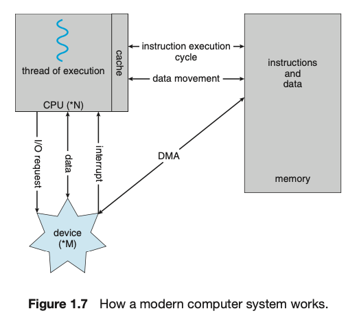
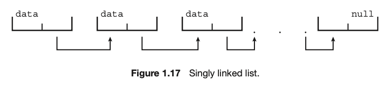

# Operating System Concepts

TENTH EDITION

ABRAHAM SILBERSCHATZ, PETER BAER HALVIN, GREG GAGNE

---

# Chapter1 Introduction

---

## 1.1 What Operating Systems Do

- The four components of a computer system

  - **hardware**
    - provides the basic computing resources for the system.
  - operating system
  - **application programs**
    - define the ways in which thses resources are used to solve users' computing problems.
  - user

- An operating system simply provides an **environment** within which other programs can do useful work.

---

## 1.1 What Operating Systems Do

## 

---

### 1.1.1 User View

The user's view of a computer varies depending on the interface used, with desktop and laptop systems designed for one user to maximize their work/play, mobile devices like smartphones and tablets featuring touch screens and voice recognition, and embedded computers in home devices and automobiles having little to no user view.

데스크톱 및 노트북 시스템은 한 명의 사용자가 업무/놀이를 극대화할 수 있도록 설계된 반면, 터치스크린과 음성 인식 기능을 갖춘 스마트폰 및 태블릿과 같은 모바일 디바이스, 가정용 기기 및 자동차의 임베디드 컴퓨터는 사용자 보기가 거의 또는 전혀 없는 등 사용하는 인터페이스에 따라 컴퓨터의 사용자 보기가 달라집니다.

---

### 1.1.2 System View

The operating system is viewed as a **resource allocator** from the computer's point of view, managing resources such as CPU time, memory space, storage space, and I/O devices, and **controlling user programs** and I/O devices to prevent errors and improper use of the computer.

운영체제는 컴퓨터의 관점에서 볼 때 CPU 시간, 메모리 공간, 저장 공간, 입출력 장치 등의 자원을 관리하고 사용자 프로그램 및 입출력 장치를 제어하여 컴퓨터의 오류 및 부적절한 사용을 방지하는 자원 할당자로 볼 수 있습니다.

---

### 1.1.3 Defining Operating Systems

The term "operating system" covers various roles and functions due to the myriad designs and uses of computers, and although there is no universally accepted definition of an operating system, it is considered to be the **kernel**, middleware frameworks, and **system programs** that aid in managing the system while it is running.

"운영 체제"라는 용어는 컴퓨터의 무수한 설계와 사용으로 인해 다양한 역할과 기능을 포함하며, 운영 체제에 대한 보편적으로 인정되는 정의는 없지만 커널, 미들웨어 프레임워크 및 시스템이 실행되는 동안 시스템을 관리하는 데 도움이 되는 시스템 프로그램으로 간주됩니다.

---

### WHY STUDY OPERATING SYSTEM?

Studying operating systems is important because almost all code runs on top of an operating system, making knowledge of how they work crucial for proper, efficient, effective, and secure programming, as understanding their fundamentals and how they drive computer hardware is essential for programmers and users alike.

거의 모든 코드가 운영 체제 위에서 실행되므로 운영 체제에 대한 지식은 적절하고 효율적이며 효과적이고 안전한 프로그래밍을 위해 매우 중요하며, 운영 체제의 기본 사항과 컴퓨터 하드웨어를 구동하는 방식을 이해하는 것은 프로그래머와 사용자 모두에게 필수적이기 때문입니다.

---

## 1.2 Computer-System Organization

A modern general-purpose computer system includes CPUs and device controllers connected through a common bus, with device controllers responsible for specific types of devices and maintaining local buffer storage and special-purpose registers, and operating systems having a device driver for each controller to provide a uniform interface to the device. The system operates through interrupts, storage structure, and I/O structure.

최신 범용 컴퓨터 시스템은 공통 버스를 통해 연결된 CPU와 장치 컨트롤러를 포함하며, 장치 컨트롤러는 특정 유형의 장치를 담당하고 로컬 버퍼 스토리지 및 특수 목적 레지스터를 유지 관리하며, 운영 체제는 각 컨트롤러에 대한 장치 드라이버를 통해 장치에 균일한 인터페이스를 제공합니다. 시스템은 인터럽트, 스토리지 구조, 입출력 구조를 통해 작동합니다.

---

## 1.2 Computer-System Organization

---

### 1.2.1 Interrupts

During a typical computer operation involving I/O, the device driver loads the appropriate registers in the device controller, which starts the data transfer and informs the device driver of its completion through an interrupt, which is a mechanism used by the controller to alert the CPU to events that require attention.

I/O와 관련된 일반적인 컴퓨터 작업 중에 장치 드라이버는 장치 컨트롤러에 적절한 레지스터를 로드하여 데이터 전송을 시작하고 컨트롤러가 주의가 필요한 이벤트를 CPU에 알리기 위해 사용하는 메커니즘인 인터럽트를 통해 완료를 장치 드라이버에 알립니다.

---

#### 1.2.1.1 Overview

Interrupts are signals sent by hardware to the CPU through the system bus to alert the CPU of events that require attention, with the CPU immediately transferring execution to a fixed location to run the interrupt service routine before resuming the interrupted computation; a table of pointers to interrupt routines is used to provide necessary speed and the interrupt architecture must save the state information of whatever was interrupted so that it can restore it after servicing the interrupt.

인터럽트는 하드웨어가 시스템 버스를 통해 CPU에 보내는 신호로, 주의가 필요한 이벤트를 CPU에 알리기 위해 CPU는 즉시 실행을 고정된 위치로 이전하여 중단된 연산을 재개하기 전에 인터럽트 서비스 루틴을 실행합니다. 인터럽트 루틴에 대한 포인터 테이블은 필요한 속도를 제공하기 위해 사용되며 인터럽트 아키텍처는 중단된 상태의 정보를 저장하여 인터럽트 서비스 후 복원할 수 있도록 해야 합니다.

---

---

#### 1.2.1.2 Implementation

The interrupt mechanism in computer systems works by using interrupt request lines and interrupt vectors to handle asynchronous events such as device-generated interrupts, with a system of interrupt priorities allowing for the handling of the most urgent work first, and interrupt chaining used to deal with large numbers of interrupt handlers.

컴퓨터 시스템의 인터럽트 메커니즘은 인터럽트 요청 라인과 인터럽트 벡터를 사용하여 장치 생성 인터럽트와 같은 비동기 이벤트를 처리하는 방식으로 작동하며, 가장 긴급한 작업을 먼저 처리할 수 있는 인터럽트 우선순위 시스템과 많은 수의 인터럽트 처리기를 처리하는 데 사용되는 인터럽트 연쇄를 사용합니다.

---

---

---

### 1.2.2 Storage Structure

A computer system requires memory to store programs and data. Main memory is volatile and usually implemented in DRAM. For permanent storage, computer systems use secondary storage devices like HDDs and NVM devices, which are nonvolatile. Secondary storage is slower than main memory, so managing it is crucial. A hierarchy of storage systems exists, with faster and smaller memory closer to the CPU. Electrical storage, like flash memory, is faster but more expensive than mechanical storage, like HDDs. A complete storage system should balance all factors and use caching to improve performance.

컴퓨터 시스템에는 프로그램과 데이터를 저장하기 위한 메모리가 필요합니다. 주 메모리는 휘발성이며 일반적으로 DRAM으로 구현됩니다. 영구 저장을 위해 컴퓨터 시스템은 비휘발성인 HDD 및 NVM 장치와 같은 보조 저장 장치를 사용합니다. 보조 스토리지는 주 메모리보다 속도가 느리기 때문에 관리가 중요합니다. 스토리지 시스템의 계층 구조가 존재하며, 더 빠르고 작은 메모리가 CPU에 더 가깝습니다. 플래시 메모리와 같은 전기식 스토리지는 HDD와 같은 기계식 스토리지보다 빠르지만 더 비쌉니다. 완벽한 스토리지 시스템은 모든 요소의 균형을 맞추고 캐싱을 사용하여 성능을 개선해야 합니다.

---

#### STORAGE DEFINITIONS AND NOTATION

The basic unit of computer storage is a bit, which can have a value of 0 or 1. Most computer storage is based on collections of bits, with a byte being the smallest convenient chunk of storage, consisting of 8 bits. A word is a computer architecture's native unit of data, made up of one or more bytes. Computer storage is generally measured and manipulated in bytes and collections of bytes, with larger units being kilobytes, megabytes, gigabytes, terabytes, and petabytes. Computer manufacturers may round off these numbers, and networking measurements are an exception, as they are given in bits.

컴퓨터 저장소의 기본 단위는 비트이며 0 또는 1의 값을 가질 수 있습니다. 대부분의 컴퓨터 저장소는 비트 모음을 기반으로 하며, 바이트는 8비트로 구성된 가장 작은 저장소 덩어리입니다. 워드(word)는 하나 이상의 바이트로 구성된 컴퓨터 아키텍처의 기본 데이터 단위입니다. 컴퓨터 스토리지는 일반적으로 바이트와 바이트 모음으로 측정 및 조작되며, 더 큰 단위로는 킬로바이트, 메가바이트, 기가바이트, 테라바이트, 페타바이트가 있습니다. 컴퓨터 제조업체는 이러한 숫자를 반올림할 수 있으며, 네트워킹 측정값은 비트 단위로 제공되므로 예외입니다.

---

---

### 1.2.3 I/O Structure

A significant portion of operating system code is dedicated to managing input/output (I/O) due to the importance of I/O to system reliability and performance and the varying nature of devices. Direct memory access (DMA) is used for bulk data movement as it reduces overhead by allowing the device controller to transfer data directly to or from main memory without CPU intervention. High-end systems use a switch architecture instead of a shared bus, which makes DMA even more effective. Figure 1.7 shows the components of a computer system and their interplay.

시스템 안정성과 성능에 대한 입출력의 중요성과 장치의 다양한 특성으로 인해 운영 체제 코드의 상당 부분이 입출력(I/O) 관리에 할당되어 있습니다. 직접 메모리 액세스(DMA)는 장치 컨트롤러가 CPU 개입 없이 메인 메모리로 또는 메인 메모리에서 직접 데이터를 전송할 수 있도록 하여 오버헤드를 줄여주기 때문에 대량 데이터 이동에 사용됩니다. 하이엔드 시스템에서는 공유 버스 대신 스위치 아키텍처를 사용하므로 DMA가 훨씬 더 효과적입니다. 그림 1.7은 컴퓨터 시스템의 구성 요소와 이들의 상호 작용을 보여줍니다.

---

---

## 1.3 Computer-System Architecture

### 1.3.1 Single-Processor Systems

This section discusses the history of computer systems with a single processor containing one CPU with a single processing core, which is capable of executing a general-purpose instruction set. Such systems also have other special-purpose processors, such as device-specific processors that run a limited instruction set and do not run processes. The use of special-purpose microprocessors is common and does not turn a single-processor system into a multiprocessor. However, very few contemporary computer systems are single-processor systems.

이 섹션에서는 범용 명령어 집합을 실행할 수 있는 단일 처리 코어를 가진 하나의 CPU가 포함된 단일 프로세서가 있는 컴퓨터 시스템의 역사에 대해 설명합니다. 이러한 시스템에는 제한된 명령어 집합을 실행하고 프로세스를 실행하지 않는 장치별 프로세서와 같은 다른 특수 목적 프로세서도 있습니다. 특수 목적 마이크로프로세서의 사용은 일반적이며 단일 프로세서 시스템을 멀티 프로세서로 전환하지 않습니다. 그러나 최신 컴퓨터 시스템 중 단일 프로세서 시스템인 경우는 거의 없습니다.

---

### 1.3.2 Multiprocessor Systems

Multiprocessor systems dominate modern computers, with two or more processors, each with a single-core CPU, sharing the computer bus and memory. The most common type of multiprocessor system is symmetric multiprocessing (SMP), which allows for many processes to run simultaneously. Multicore systems, in which multiple computing cores reside on a single chip, are also considered multiprocessor systems. Non-uniform memory access (NUMA) systems provide each CPU with its own local memory and a shared system interconnect, allowing for effective scaling as more processors are added. Blade servers are systems in which multiple processor boards, I/O boards, and networking boards are placed in the same chassis, with each blade-processor board booting independently and running its own operating system.

---

멀티프로세서 시스템은 컴퓨터 버스와 메모리를 공유하는 두 개 이상의 프로세서(각각 단일 코어 CPU)가 있는 최신 컴퓨터의 주류를 이룹니다. 가장 일반적인 멀티프로세서 시스템 유형은 대칭형 멀티프로세싱(SMP)으로, 여러 프로세스를 동시에 실행할 수 있습니다. 여러 컴퓨팅 코어가 단일 칩에 상주하는 멀티코어 시스템도 멀티프로세서 시스템으로 간주됩니다. 비균일 메모리 액세스(NUMA) 시스템은 각 CPU에 자체 로컬 메모리와 공유 시스템 상호 연결을 제공하므로 프로세서가 추가될 때 효과적으로 확장할 수 있습니다. 블레이드 서버는 여러 프로세서 보드, I/O 보드, 네트워킹 보드가 동일한 섀시에 배치된 시스템으로, 각 블레이드 프로세서 보드가 독립적으로 부팅되고 자체 운영 체제를 실행합니다.

---

---

---

---

#### DEFINITIONS OF COMPUTER SYSTEM COMPONENTS

• **CPU** — The hardware that executes instructions.
• **Processor** — A physical chip that contains one or more CPUs.
• **Core** — The basic computation unit of the CPU.
• **Multicore** — Including multiple computing cores on the same CPU.
• **Multiprocessor** — Including multiple processors.

Although virtually all systems are now multicore, we use the general term **_CPU_** when referring to a single computational unit of a computer system and **_core_** as well as **_multicore_** when specifically referring to one or more cores on a CPU.

---

### 1.3.3 Clustered Systems

Clustered systems are composed of multiple individual systems, or nodes, joined together via a local-area network or a faster interconnect. Clustering is usually used to provide high-availability service, where each node can monitor one or more of the others, and if a monitored machine fails, the monitoring machine can take ownership of its storage and restart the applications that were running on the failed machine. Clustering can be structured asymmetrically or symmetrically. Additionally, clusters can also be used to provide high-performance computing environments, where an application is written specifically to take advantage of the cluster via parallelization. There are other forms of clusters, including parallel clusters and clustering over a wide-area network. Cluster technology is changing rapidly, and many improvements are made possible by storage-area networks.

---

클러스터링 시스템은 로컬 영역 네트워크 또는 더 빠른 상호 연결을 통해 함께 연결된 여러 개별 시스템 또는 노드로 구성됩니다. 클러스터링은 일반적으로 고가용성 서비스를 제공하는 데 사용되며, 각 노드는 하나 이상의 다른 노드를 모니터링할 수 있고 모니터링 중인 시스템에 장애가 발생하면 모니터링 시스템이 스토리지의 소유권을 가져와 장애가 발생한 시스템에서 실행 중이던 애플리케이션을 다시 시작할 수 있습니다. 클러스터링은 비대칭 또는 대칭으로 구성할 수 있습니다. 또한 클러스터는 병렬화를 통해 클러스터를 활용하도록 특별히 작성된 애플리케이션이 있는 고성능 컴퓨팅 환경을 제공하는 데에도 사용할 수 있습니다. 병렬 클러스터와 광역 네트워크를 통한 클러스터링 등 다른 형태의 클러스터도 있습니다. 클러스터 기술은 빠르게 변화하고 있으며, 스토리지 영역 네트워크를 통해 많은 개선이 이루어지고 있습니다.

---

---

## 1.4 Operating-System Operations

This passage provides an introduction to operating systems, explaining that they provide the environment in which programs are executed. It also discusses the role of the bootstrap program in initializing the system and loading the operating system kernel into memory. Once the kernel is loaded, it can provide services to the system and its users, and system programs can be loaded to become system daemons. The passage also explains that the operating system will wait for events to occur, signaled by interrupts, which can be either hardware interrupts or software-generated interrupts called traps or exceptions, caused by errors or specific requests from user programs.

---

이 단원에서는 운영 체제에 대한 소개를 통해 운영 체제가 프로그램이 실행되는 환경을 제공한다는 점을 설명합니다. 또한 시스템을 초기화하고 운영 체제 커널을 메모리에 로드하는 부트스트랩 프로그램의 역할에 대해 설명합니다. 커널이 로드되면 시스템과 사용자에게 서비스를 제공할 수 있으며, 시스템 프로그램을 로드하여 시스템 데몬이 될 수 있습니다. 또한 이 단원에서는 운영 체제가 오류 또는 사용자 프로그램의 특정 요청으로 인해 발생하는 하드웨어 인터럽트 또는 트랩 또는 예외라고 하는 소프트웨어 생성 인터럽트일 수 있는 인터럽트로 신호되는 이벤트가 발생할 때까지 기다린다고 설명합니다.

---

## HADOOP

Hadoop is an open-source software framework used for distributed processing of large data sets in a clustered system. It is designed to scale from a single system to a cluster containing thousands of computing nodes. Hadoop includes a distributed file system, YARN framework, and MapReduce system, which allow for parallel processing of data across nodes in the cluster. Hadoop is highly reliable and efficient in managing failures in nodes. It is designed to run on Linux systems and supports several programming languages including PHP, Perl, Python, and Java. More information on MapReduce and Hadoop can be found at https://hadoop.apache.org/docs/r1.2.1/mapred tutorial.html and https://hadoop.apache.org.

---

Hadoop은 클러스터된 시스템에서 대규모 데이터 집합을 분산 처리하는 데 사용되는 오픈 소스 소프트웨어 프레임워크입니다. 단일 시스템에서 수천 개의 컴퓨팅 노드가 포함된 클러스터로 확장할 수 있도록 설계되었습니다. Hadoop에는 클러스터의 노드 간에 데이터를 병렬 처리할 수 있는 분산 파일 시스템, YARN 프레임워크, MapReduce 시스템이 포함되어 있습니다. Hadoop은 노드의 장애를 관리하는 데 있어 매우 안정적이고 효율적입니다. Linux 시스템에서 실행되도록 설계되었으며 PHP, Perl, Python, Java를 비롯한 여러 프로그래밍 언어를 지원합니다. MapReduce 및 Hadoop에 대한 자세한 정보는 https://hadoop.apache.org/docs/r1.2.1/mapred tutorial.html 및 https://hadoop.apache.org 에서 확인할 수 있습니다.

---

### 1.4.1 Multiprogramming and Multitasking

Operating systems can run multiple programs simultaneously, which increases CPU utilization and keeps users satisfied. In a multiprogramming system, several processes are kept in memory simultaneously, and the operating system switches between them when one process needs to wait for some task to complete. In a multitasking system, the CPU rapidly switches between processes, providing the user with a fast response time. Memory management, CPU scheduling, and file systems are important aspects of multiprogramming and multitasking systems. Virtual memory allows the execution of a process that is not completely in memory and frees programmers from memory-storage limitations. A file system and storage management must be provided, and resources must be protected from inappropriate use. Process synchronization and communication are important, as well as ensuring that processes do not get stuck in a deadlock.

---

운영 체제는 여러 프로그램을 동시에 실행할 수 있으므로 CPU 사용률을 높이고 사용자 만족도를 높일 수 있습니다. 멀티프로그래밍 시스템에서는 여러 프로세스가 동시에 메모리에 보관되며, 한 프로세스가 특정 작업이 완료될 때까지 기다려야 할 때 운영 체제가 프로세스 간에 전환합니다. 멀티태스킹 시스템에서는 CPU가 프로세스 간에 빠르게 전환하여 사용자에게 빠른 응답 시간을 제공합니다. 메모리 관리, CPU 스케줄링 및 파일 시스템은 멀티프로그래밍 및 멀티태스킹 시스템의 중요한 측면입니다. 가상 메모리를 사용하면 메모리에 완전히 들어 있지 않은 프로세스를 실행할 수 있으며 프로그래머는 메모리 저장 공간의 제약에서 벗어날 수 있습니다. 파일 시스템과 스토리지 관리가 제공되어야 하며 리소스가 부적절하게 사용되지 않도록 보호해야 합니다. 프로세스 동기화 및 통신은 물론 프로세스가 교착 상태에 빠지지 않도록 하는 것도 중요합니다.

---

---

### 1.4.2 Dual-Mode and Multimode Operation

Most computer systems provide hardware support that allows differentiation among various modes of execution to ensure that an incorrect or malicious program cannot cause other programs or the operating system itself to execute incorrectly. Dual-mode of operation includes user mode and kernel mode, with a mode bit added to the hardware of the computer to indicate the current mode. User mode is when a computer system is executing on behalf of a user application, and kernel mode is when the operating system gains control of the computer. Privileged instructions can only be executed in kernel mode. CPUs that support virtualization frequently have a separate mode to indicate when the virtual machine manager is in control of the system. System calls are invoked to ask the operating system to perform tasks reserved for the operating system on the user program's behalf. When a system call is executed, it is treated by the hardware as a software interrupt, and control passes through the interrupt vector to a service routine in the operating system. Once hardware protection is in place, it detects errors that violate modes, which are normally handled by the operating system.

---

대부분의 컴퓨터 시스템은 잘못되거나 악의적인 프로그램으로 인해 다른 프로그램이나 운영 체제 자체가 잘못 실행되지 않도록 다양한 실행 모드를 구분할 수 있는 하드웨어 지원을 제공합니다. 이중 작동 모드에는 사용자 모드와 커널 모드가 있으며, 컴퓨터의 하드웨어에 모드 비트가 추가되어 현재 모드를 나타냅니다. 사용자 모드는 컴퓨터 시스템이 사용자 애플리케이션을 대신하여 실행되는 경우이며, 커널 모드는 운영 체제가 컴퓨터를 제어하는 경우입니다. 권한 있는 명령은 커널 모드에서만 실행할 수 있습니다. 가상화를 지원하는 CPU에는 가상 머신 관리자가 시스템을 제어할 수 있는 시점을 나타내는 별도의 모드가 있는 경우가 많습니다. 시스템 호출은 운영 체제가 사용자 프로그램을 대신하여 운영 체제용으로 예약된 작업을 수행하도록 요청하기 위해 호출됩니다. 시스템 호출이 실행되면 하드웨어에서는 이를 소프트웨어 인터럽트로 취급하고 인터럽트 벡터를 통해 운영 체제의 서비스 루틴으로 제어권이 전달됩니다. 하드웨어 보호가 적용되면 운영 체제에서 일반적으로 처리하는 모드를 위반하는 오류를 감지합니다.

---

---

### 1.4.3 Timer

To ensure that the operating system maintains control over the CPU, a timer can be used. The timer is set to interrupt the computer after a specified period, which may be fixed or variable. A variable timer is generally implemented by a fixed-rate clock and a counter. The operating system sets the counter, and every time the clock ticks, the counter is decremented. When the counter reaches 0, an interrupt occurs. Before turning over control to the user, the operating system ensures that the timer is set to interrupt. If the timer interrupts, control transfers automatically to the operating system, which may treat the interrupt as a fatal error or may give the program more time. Instructions that modify the content of the timer are privileged.

---

운영 체제가 CPU를 계속 제어할 수 있도록 타이머를 사용할 수 있습니다. 타이머는 지정된 기간이 지나면 컴퓨터를 중단하도록 설정되며, 고정 또는 가변일 수 있습니다. 가변 타이머는 일반적으로 고정 속도 클럭과 카운터로 구현됩니다. 운영 체제가 카운터를 설정하고 시계가 틱할 때마다 카운터가 감소합니다. 카운터가 0에 도달하면 인터럽트가 발생합니다. 사용자에게 제어권을 넘기기 전에 운영 체제는 타이머가 인터럽트되도록 설정되어 있는지 확인합니다. 타이머가 인터럽트되면 제어권이 운영 체제로 자동 이전되며, 운영 체제는 인터럽트를 치명적인 오류로 처리하거나 프로그램에 더 많은 시간을 제공할 수 있습니다. 타이머의 내용을 수정하는 명령에는 권한이 있습니다.

---

#### LINUX TIMERS

On Linux systems, the frequency of timer interrupts is specified by the kernel configuration parameter HZ. The value of HZ determines how many interrupts are generated per second, with an HZ value of 250 indicating one interrupt every 4 milliseconds. The value of HZ depends on the kernel configuration, as well as the machine type and architecture on which it is running. Another related kernel variable is jiffies, which represents the number of timer interrupts that have occurred since the system was booted. A programming project in Chapter 2 further explores timing in the Linux kernel.

Linux 시스템에서 타이머 인터럽트 빈도는 커널 구성 매개변수 HZ로 지정됩니다. HZ 값에 따라 초당 생성되는 인터럽트 수가 결정되며, HZ 값이 250이면 4밀리초마다 인터럽트 하나가 생성됩니다. HZ 값은 커널 구성과 커널이 실행 중인 머신 유형 및 아키텍처에 따라 달라집니다. 또 다른 관련 커널 변수는 시스템이 부팅된 이후 발생한 타이머 인터럽트 횟수를 나타내는 jiffies입니다. 2장의 프로그래밍 프로젝트에서는 Linux 커널의 타이밍에 대해 자세히 살펴봅니다.

---

## 1.5 Resource Management

As we have seen, an operating system is a resource manager. The system’s CPU, memory space, file-storage space, and I/O devices are among the resources that the operating system must manage.

지금까지 살펴본 것처럼 운영 체제는 리소스 관리자입니다. 시스템의 CPU, 메모리 공간, 파일 저장 공간, 입출력 장치는 운영 체제가 관리해야 하는 리소스 중 하나입니다.

---

### 1.5.1 Process Management

In this section, the concept of a process is introduced. A process is an instance of a program in execution that needs resources, such as CPU time, memory, files, and I/O devices, to accomplish its task. A process can be either a user process or an operating-system process, and both can execute concurrently on a single CPU core or in parallel across multiple CPU cores. The operating system is responsible for creating, deleting, scheduling, suspending, and resuming processes, as well as providing mechanisms for process synchronization and communication. Process-management techniques are discussed in Chapters 3 through 7.

이 섹션에서는 프로세스의 개념을 소개합니다. 프로세스는 실행 중인 프로그램의 인스턴스로, 작업을 완료하기 위해 CPU 시간, 메모리, 파일 및 I/O 장치와 같은 리소스가 필요합니다. 프로세스는 사용자 프로세스 또는 운영 체제 프로세스일 수 있으며, 둘 다 단일 CPU 코어에서 동시에 실행되거나 여러 CPU 코어에 걸쳐 병렬로 실행될 수 있습니다. 운영 체제는 프로세스를 생성, 삭제, 예약, 일시 중단 및 재개할 뿐만 아니라 프로세스 동기화 및 통신을 위한 메커니즘을 제공합니다. 프로세스 관리 기법은 3장부터 7장까지 설명합니다.

---

### 1.5.2 Memory Management

In summary, this section discusses the importance of memory management in modern computer systems. Main memory is a repository of quickly accessible data shared by the CPU and I/O devices. Programs need to be mapped to absolute addresses and loaded into memory to be executed, and as the program executes, it accesses program instructions and data from memory. The operating system is responsible for keeping track of which parts of memory are currently being used and which process is using them, allocating and deallocating memory space as needed, and deciding which processes (or parts of processes) and data to move into and out of memory. Memory management techniques are discussed in Chapter 9 and Chapter 10.

---

이 섹션에서는 최신 컴퓨터 시스템에서 메모리 관리의 중요성에 대해 간략하게 설명합니다. 주 메모리는 CPU와 I/O 장치가 공유하는 빠르게 액세스할 수 있는 데이터의 저장소입니다. 프로그램은 절대 주소에 매핑되어 메모리에 로드되어야 실행될 수 있으며, 프로그램이 실행될 때 메모리의 프로그램 명령어와 데이터에 액세스합니다. 운영 체제는 현재 메모리의 어느 부분이 사용되고 있는지, 어떤 프로세스가 메모리를 사용하고 있는지 추적하고, 필요에 따라 메모리 공간을 할당 및 할당 해제하고, 어떤 프로세스(또는 프로세스의 일부)와 데이터가 메모리로 이동하고 메모리에서 빠져나갈지 결정할 책임이 있습니다. 메모리 관리 기법은 9장과 10장에서 설명합니다.

---

### 1.5.3 File-System Management

Section 1.5.3 discusses the file-system management component of an operating system. A file is a collection of related information, and the operating system provides a uniform and logical view of information storage by mapping files onto physical media and accessing them via storage devices. The operating system is responsible for creating and deleting files and directories, supporting primitives for manipulating files and directories, mapping files onto mass storage, and backing up files on stable (nonvolatile) storage media. The concept of a file is an extremely general one and can represent programs (source and object forms) and data, and files may be free-form or rigidly formatted. Finally, when multiple users have access to files, the operating system may control access to them. Techniques for file management are discussed in Chapters 13, 14, and 15.

---

1.5.3절에서는 운영 체제의 파일 시스템 관리 구성 요소에 대해 설명합니다. 파일은 관련 정보의 모음이며, 운영 체제는 파일을 물리적 미디어에 매핑하고 저장 장치를 통해 액세스함으로써 정보 저장소에 대한 통일되고 논리적인 보기를 제공합니다. 운영 체제는 파일과 디렉터리의 생성 및 삭제, 파일과 디렉터리 조작을 위한 기본 요소 지원, 대용량 스토리지에 파일 매핑, 안정적인(비휘발성) 저장 미디어에 파일 백업 등을 담당합니다. 파일의 개념은 매우 일반적인 개념으로 프로그램(소스 및 객체 형태) 및 데이터를 나타낼 수 있으며, 파일은 자유 형식이거나 엄격한 형식일 수 있습니다. 마지막으로, 여러 사용자가 파일에 액세스할 수 있는 경우 운영 체제에서 파일에 대한 액세스를 제어할 수 있습니다. 파일 관리 기술은 13장, 14장, 15장에서 설명합니다.

---

### 1.5.4 Mass-Storage Management

In section 1.5.4, the importance of secondary storage management is discussed, as it is necessary for backing up main memory and storing programs and data. The operating system is responsible for various activities related to secondary storage management, such as mounting and unmounting, free-space management, storage allocation, disk scheduling, partitioning, and protection. Efficient use of secondary storage is crucial for the overall speed of the computer system. Additionally, there are many uses for storage that is slower and lower in cost than secondary storage, such as backups and long-term archival storage, which are examples of tertiary storage devices. The management of tertiary storage is not crucial for system performance, but some operating systems can provide functions such as mounting and unmounting media in devices, allocating and freeing the devices for exclusive use by processes, and migrating data from secondary to tertiary storage. Techniques for secondary and tertiary storage management are discussed in Chapter 11.

---

1.5.4절에서는 주 메모리를 백업하고 프로그램과 데이터를 저장하는 데 필요한 보조 스토리지 관리의 중요성에 대해 설명합니다. 운영 체제는 마운트 및 마운트 해제, 여유 공간 관리, 스토리지 할당, 디스크 스케줄링, 파티셔닝 및 보호와 같은 보조 스토리지 관리와 관련된 다양한 활동을 담당합니다. 보조 스토리지의 효율적인 사용은 컴퓨터 시스템의 전반적인 속도에 매우 중요합니다. 또한, 백업 및 장기 보관 스토리지와 같이 보조 스토리지보다 속도가 느리고 비용이 적게 드는 스토리지도 3차 스토리지 장치의 예로 많이 사용됩니다. 3차 스토리지의 관리가 시스템 성능에 중요한 것은 아니지만, 일부 운영 체제에서는 장치에 미디어 마운트 및 마운트 해제, 프로세스별 전용 장치 할당 및 해제, 2차 스토리지에서 3차 스토리지로 데이터 마이그레이션과 같은 기능을 제공할 수 있습니다. 보조 및 3 차 스토리지 관리 기술은 11 장에서 설명합니다.

---

### 1.5.5 Cache Management

This section discusses caching in computer systems, where information is temporarily copied into a faster storage system called the cache. The use of caches is important for improving performance, but cache management is also an important design problem due to limited cache size. Caches can be implemented in hardware or software, and replacement algorithms for software-controlled caches are discussed in Chapter 10. The section also explains the movement of information between different levels of a storage hierarchy, which may be either explicit or implicit depending on the hardware design and operating system software. In a multiprocessor environment, the issue of cache coherency arises, where updates to a value in one cache must be immediately reflected in all other caches where the value resides. The section ends by discussing distributed systems where replicas of the same file may be kept on different computers, and the need to ensure that updates to a replica in one place are propagated to all other replicas as soon as possible.

---

이 섹션에서는 컴퓨터 시스템에서 캐시로 불리는 더 빠른 저장 시스템에 정보를 일시적으로 복사하는 캐싱에 대해 설명합니다. 캐시 사용은 성능 향상에 중요하지만 캐시 크기는 제한되어 있기 때문에 캐시 관리도 중요한 설계 문제입니다. 캐시는 하드웨어 또는 소프트웨어로 구현할 수 있으며, 소프트웨어로 제어되는 캐시의 대체 알고리즘은 10장에서 설명합니다. 이 섹션에서는 하드웨어 설계 및 운영 체제 소프트웨어에 따라 명시적이거나 암시적일 수 있는 스토리지 계층 구조의 여러 수준 간 정보 이동에 대해서도 설명합니다. 멀티프로세서 환경에서는 캐시 일관성 문제가 발생하는데, 한 캐시의 값에 대한 업데이트가 해당 값이 있는 다른 모든 캐시에 즉시 반영되어야 합니다. 이 섹션에서는 동일한 파일의 복제본을 여러 컴퓨터에 보관할 수 있는 분산 시스템과 한 곳의 복제본에 대한 업데이트가 가능한 한 빨리 다른 모든 복제본에 전파되도록 해야 하는 필요성에 대해 논의하면서 마무리합니다.

---

---

### 1.5.6 I/O System Management

In section 1.5.6, it is discussed how the operating system hides the peculiarities of specific hardware devices from the user. This is achieved through the I/O subsystem, which includes a memory-management component that buffers, caches, and spools data, a general device-driver interface, and specific drivers for each hardware device. Only the device driver knows the peculiarities of the device it is assigned to. The chapter also discusses interrupt handlers and how they are used in constructing efficient I/O subsystems. Finally, Chapter 12 is mentioned as the section where the I/O subsystem's interfaces to other system components, device management, data transfer, and I/O completion are discussed.

---

1.5.6절에서는 운영 체제가 특정 하드웨어 장치의 특성을 사용자로부터 숨기는 방법에 대해 설명합니다. 이는 데이터를 버퍼링, 캐시 및 스풀링하는 메모리 관리 구성 요소, 일반 장치-드라이버 인터페이스 및 각 하드웨어 장치에 대한 특정 드라이버를 포함하는 I/O 하위 시스템을 통해 이루어집니다. 장치 드라이버만이 자신에게 할당된 장치의 특성을 알고 있습니다. 또한 이 장에서는 인터럽트 핸들러와 효율적인 I/O 하위 시스템을 구성하는 데 사용되는 방법에 대해 설명합니다. 마지막으로 12장에서는 다른 시스템 구성 요소에 대한 I/O 서브시스템의 인터페이스, 장치 관리, 데이터 전송 및 I/O 완성에 대해 설명합니다.

---

## 1.6 Security and Protection

This section discusses the importance of security and protection in computer systems. Protection refers to mechanisms that regulate access to resources in a system to ensure that only authorized processes or users can operate on them. Protection mechanisms can detect interface errors and prevent unauthorized usage of a resource. Security, on the other hand, involves defending a system from external and internal attacks such as viruses, worms, identity theft, and unauthorized access. Most operating systems maintain a list of user names and associated user IDs to distinguish among all its users, and group functionality can be implemented to distinguish among sets of users. Additionally, operating systems provide methods to allow privilege escalation for users who need extra permissions to perform certain activities. The chapter also notes that security features are a fast-growing area of research and implementation.

---

이 섹션에서는 컴퓨터 시스템에서 보안 및 보호의 중요성에 대해 설명합니다. 보호는 시스템의 리소스에 대한 액세스를 규제하여 권한이 부여된 프로세스 또는 사용자만 해당 리소스에서 작업할 수 있도록 하는 메커니즘을 말합니다. 보호 메커니즘은 인터페이스 오류를 감지하고 리소스의 무단 사용을 방지할 수 있습니다. 반면 보안은 바이러스, 웜, 신원 도용, 무단 액세스와 같은 외부 및 내부 공격으로부터 시스템을 방어하는 것을 포함합니다. 대부분의 운영 체제는 모든 사용자를 구분하기 위해 사용자 이름 및 관련 사용자 ID 목록을 유지 관리하며, 사용자 집합을 구분하기 위해 그룹 기능을 구현할 수 있습니다. 또한 운영 체제는 특정 활동을 수행하기 위해 추가 권한이 필요한 사용자를 위해 권한 에스컬레이션을 허용하는 방법을 제공합니다. 이 장에서는 보안 기능이 빠르게 성장하고 있는 연구 및 구현 영역이라는 점도 언급합니다.

---

## 1.7 Virtualization

In summary, virtualization is a technology that allows the hardware of a single computer to be abstracted into several different execution environments, creating the illusion that each environment is running on its own private computer. Virtualization allows operating systems to run as applications within other operating systems, and it first came about as a method for multiple users to run tasks concurrently on IBM mainframes. The virtual machine manager (VMM) runs guest operating systems, manages their resource use, and protects each guest from the others. Virtualization continues to grow in popularity as it allows users to install multiple operating systems for exploration, run applications written for other operating systems, and execute and manage computing environments within data centers. The features and implementation of virtualization are discussed in Chapter 18.

---

요약하자면, 가상화는 단일 컴퓨터의 하드웨어를 여러 개의 서로 다른 실행 환경으로 추상화하여 각 환경이 마치 각각의 개인 컴퓨터에서 실행되는 것처럼 보이게 하는 기술입니다. 가상화는 운영 체제를 다른 운영 체제 내에서 애플리케이션으로 실행할 수 있게 해주며, IBM 메인프레임에서 여러 사용자가 동시에 작업을 실행할 수 있는 방법으로 처음 등장했습니다. 가상 머신 관리자(VMM)는 게스트 운영 체제를 실행하고 리소스 사용을 관리하며 각 게스트를 다른 게스트로부터 보호합니다. 가상화는 사용자가 탐색을 위해 여러 운영 체제를 설치하고, 다른 운영 체제용으로 작성된 애플리케이션을 실행하고, 데이터 센터 내에서 컴퓨팅 환경을 실행 및 관리할 수 있게 해주므로 그 인기가 계속 높아지고 있습니다. 가상화의 기능 및 구현에 대해서는 18장에서 설명합니다.

---

---

## 1.8 Distributed Systems

In this section, the concept of distributed systems is introduced, which refers to a collection of physically separate computer systems that are networked together to provide users access to shared resources. The benefits of distributed systems include increased computation speed, functionality, data availability, and reliability. Operating systems provide different levels of support for networking, including the ability to generalize network access as a form of file access or to have users specifically invoke network functions. Networks are characterized based on the distances between nodes, including local-area networks (LANs) and wide-area networks (WANs), and the media used to carry the network, including copper wires, fiber strands, and wireless transmissions. Some operating systems have taken the concept of networks and distributed systems further by providing features such as file sharing and communication schemes that allow processes on different computers to exchange messages. These concepts are discussed further in Chapter 19.

---

이 섹션에서는 사용자에게 공유 리소스에 대한 액세스를 제공하기 위해 함께 네트워크로 연결된 물리적으로 분리된 컴퓨터 시스템의 집합을 의미하는 분산 시스템의 개념을 소개합니다. 분산 시스템의 장점으로는 계산 속도, 기능, 데이터 가용성 및 안정성 향상 등이 있습니다. 운영 체제는 네트워크 액세스를 파일 액세스의 한 형태로 일반화하거나 사용자가 네트워크 기능을 특별히 호출할 수 있는 기능을 포함하여 다양한 수준의 네트워킹을 지원합니다. 네트워크는 LAN(로컬 영역 네트워크)과 WAN(광역 네트워크) 등 노드 간의 거리와 구리선, 광섬유 가닥, 무선 전송 등 네트워크를 전달하는 데 사용되는 미디어에 따라 특징이 구분됩니다. 일부 운영 체제에서는 서로 다른 컴퓨터의 프로세스가 메시지를 교환할 수 있는 파일 공유 및 통신 체계와 같은 기능을 제공하여 네트워크 및 분산 시스템의 개념을 더욱 발전시켰습니다. 이러한 개념은 19장에서 자세히 설명합니다.

---

## 1.9 Kernel Data Structures

This section briefly introduces some fundamental data structures used extensively in operating systems. It suggests readers consult the bibliography at the end of the chapter for more details on these and other structures.

이 섹션에서는 운영 체제에서 광범위하게 사용되는 몇 가지 기본 데이터 구조를 간략하게 소개합니다. 이러한 구조와 기타 구조에 대한 자세한 내용은 이 장의 마지막에 있는 참고 문헌을 참조하시기 바랍니다.

---

### 1.9.1 Lists, Stacks, and Queues

This section discusses fundamental data structures used in operating systems, including lists, stacks, and queues. An array is a simple data structure that allows each element to be accessed directly, whereas lists must be accessed in a particular order. Linked lists are the most common method for implementing lists, with several types including singly linked, doubly linked, and circularly linked lists. Stacks and queues are sequentially ordered data structures that use the LIFO and FIFO principles, respectively. Stacks are often used for function calls in operating systems, while queues are common in situations where items are removed in the order in which they were added, such as printing jobs or CPU task scheduling.

---

이 섹션에서는 리스트, 스택, 큐 등 운영 체제에서 사용되는 기본적인 데이터 구조에 대해 설명합니다. 배열은 각 요소에 직접 액세스할 수 있는 간단한 데이터 구조인 반면, 리스트는 특정 순서로 액세스해야 합니다. 연결된 목록은 목록을 구현하는 가장 일반적인 방법이며 단일 링크, 이중 링크, 순환 링크 등 여러 유형이 있습니다. 스택과 큐는 순차적으로 정렬된 데이터 구조로, 각각 LIFO와 FIFO 원칙을 사용합니다. 스택은 운영 체제에서 함수 호출에 자주 사용되는 반면, 큐는 인쇄 작업이나 CPU 작업 스케줄링과 같이 항목이 추가된 순서대로 제거되는 상황에서 흔히 사용됩니다.

---

---

### 1.9.2 Trees

The section describes the use of trees as a data structure to represent data hierarchically. Trees link data values through parent-child relationships. A general tree allows a parent to have an unlimited number of children while a binary tree allows at most two children, left and right. A binary search tree requires an ordering between the parent's two children, where the left child <= right child. The worst-case performance when searching for an item in a binary search tree is O(n). To improve the performance, an algorithm can be used to create a balanced binary search tree, where the tree containing n items has at most lg n levels, ensuring a worst-case performance of O(lg n). The section also notes that Linux uses a balanced binary search tree, known as a red-black tree, as part of its CPU-scheduling algorithm.

---

이 섹션에서는 트리를 데이터 구조로 사용하여 데이터를 계층적으로 표현하는 방법을 설명합니다. 트리는 부모-자식 관계를 통해 데이터 값을 연결합니다. 일반 트리는 부모가 무제한의 자식을 가질 수 있도록 허용하는 반면 이진 트리는 최대 두 개의 자식(왼쪽 및 오른쪽)을 허용합니다. 이진 검색 트리는 왼쪽 자식 <= 오른쪽 자식인 부모의 두 자식 간에 순서가 필요합니다. 이진 검색 트리에서 항목을 검색할 때 최악의 성능은 O(n)입니다. 성능을 향상시키기 위해 알고리즘을 사용하여 균형 잡힌 이진 검색 트리를 만들 수 있습니다. 여기서 n 항목을 포함하는 트리는 최대 lg n 수준을 가지며 최악의 경우 O(lg n)의 성능을 보장합니다. 이 섹션은 또한 Linux가 CPU 스케줄링 알고리즘의 일부로 레드-블랙 트리로 알려진 균형 잡힌 이진 검색 트리를 사용한다는 점에 주목합니다.

---

---

### 1.9.3 Hash Function and Maps

In section 1.9, the author discusses several fundamental data structures used extensively in operating systems. The section covers lists, stacks, and queues, which are linked data structures used to store and manage data. A stack uses the last in, first out (LIFO) principle, while a queue uses the first in, first out (FIFO) principle. The author also explains trees, which are data structures that can represent data hierarchically using parent-child relationships. The section explains binary trees and binary search trees, which are binary trees with an ordering between the parent's two children. Finally, the author describes hash functions and maps. A hash function takes data as input, performs a numeric operation on the data, and returns a numeric value that can be used as an index into a table to quickly retrieve the data. A hash map associates (or maps) [key:value] pairs using a hash function.

---

섹션 1.9에서 저자는 운영 체제에서 광범위하게 사용되는 몇 가지 기본 데이터 구조에 대해 설명합니다. 이 섹션에서는 데이터를 저장하고 관리하는 데 사용되는 연결된 데이터 구조인 목록, 스택 및 대기열을 다룹니다. 스택은 후입선출(LIFO) 원칙을 사용하고 큐는 선입선출(FIFO) 원칙을 사용합니다. 저자는 또한 부모-자식 관계를 사용하여 데이터를 계층적으로 나타낼 수 있는 데이터 구조인 트리에 대해 설명합니다. 이 섹션에서는 부모의 두 자식 간에 순서가 있는 이진 트리인 이진 트리 및 이진 검색 트리에 대해 설명합니다. 마지막으로 저자는 해시 함수와 맵에 대해 설명합니다. 해시 함수는 데이터를 입력으로 받아 데이터에 대해 숫자 연산을 수행하고 테이블에 인덱스로 사용할 수 있는 숫자 값을 반환하여 데이터를 빠르게 검색합니다. 해시 맵은 해시 함수를 사용하여 [key:value] 쌍을 연결(또는 매핑)합니다.

---

---

### 1.9.4 Bitmaps

In computer science, a bitmap is a string of binary digits (bits) used to represent the status of a set of items. Each bit represents the status of an item, where 0 indicates the item is available and 1 indicates it is unavailable (or vice versa). The value of the i-th position in the bitmap is associated with the i-th item.

Bitmaps are space-efficient compared to other data structures that use Boolean values, as they only require a single bit to represent the status of an item. Therefore, bitmaps are commonly used to represent the availability of a large number of resources, such as disk blocks in a medium-sized disk drive.

Data structures, including bitmaps, are commonly used in operating system implementations to manage and organize resources. They will be discussed throughout the text as kernel algorithms and their implementations are explored.

---

컴퓨터 과학에서 비트맵은 일련의 항목 상태를 나타내는 데 사용되는 이진수(비트) 문자열입니다. 각 비트는 항목의 상태를 나타내며, 여기서 0은 항목이 사용 가능함을 나타내고 1은 사용할 수 없음을 나타냅니다(또는 그 반대). 비트맵의 i번째 위치 값은 i번째 항목과 연결됩니다.

비트맵은 항목의 상태를 나타내는 데 단일 비트만 필요하므로 부울 값을 사용하는 다른 데이터 구조에 비해 공간 효율적입니다. 따라서 비트맵은 일반적으로 중간 크기 디스크 드라이브의 디스크 블록과 같은 많은 리소스의 가용성을 나타내는 데 사용됩니다.

비트맵을 비롯한 데이터 구조는 일반적으로 운영 체제 구현에서 리소스를 관리하고 구성하는 데 사용됩니다. 커널 알고리즘과 그 구현을 탐구할 때 본문 전체에서 논의될 것입니다.

---

#### _LINUX KERNEL DATA STRUCTURES_

The data structures used in the Linux kernel are available in the kernel source code. The **_include_** file `<linux/list.h>` provides details of the linked-list data structure used throughout the kernel. A queue in Linux is known as a `kfifo`, and its implementation can be found in the `kfifo.c` file in the `kernel` directory of the source code. Linux also provides a balanced binary search tree implementation using **_red-black trees_**. Details can be found in the include file `<linux/rbtree.h>`.

리눅스 커널에서 사용되는 데이터 구조는 커널 소스 코드에서 확인할 수 있습니다. **_include_** 파일 `<linux/list.h>`에서는 커널 전체에서 사용되는 연결 리스트 데이터 구조에 대한 자세한 내용을 제공합니다. 리눅스에서 큐는 `kfifo`로 알려져 있으며, 그 구현은 소스 코드의 `kernel` 디렉토리에 있는 `kfifo.c` 파일에서 찾을 수 있습니다. 또한 리눅스는 **레드-블랙 트리**를 사용하여 균형 이진 탐색 트리 구현을 제공합니다. 자세한 내용은 include 파일 `<linux/rbtree.h>`에서 찾을 수 있습니다.

---

## 1.10 Computing Environments

So far, we have briefly described several aspects of computer systems and the operating systems that manage them. We turn now to a discussion of how operating systems are used in a variety of computing environments.

지금까지 컴퓨터 시스템의 여러 측면과 이를 관리하는 운영 체제에 대해 간략하게 설명했습니다. 이제 다양한 컴퓨팅 환경에서 운영 체제를 사용하는 방법에 대해 논의하겠습니다.

---

### 1.10.1 Traditional Computing

As computing has evolved, traditional boundaries between computing environments have blurred. The typical office environment, which used to consist of PCs connected to a network with servers providing file and print services, has expanded to include web technologies and increasing WAN bandwidth. Companies now establish portals to provide web accessibility to their internal servers. Network computers, which are essentially terminals that understand web-based computing, are used in place of traditional workstations for better security or easier maintenance. Mobile computers and devices also allow for more portable use of company information.

At home, users now have more access to data due to relatively inexpensive network-connection speeds that were once only available at great cost. Fast data connections enable home computers to serve up web pages and run networks that include printers, client PCs, and servers. Many homes use firewalls to protect their networks from security breaches.

---

In the past, computing resources were scarce, and batch and interactive systems were used to process jobs. Multiple users shared time on these systems, and time-sharing systems used a timer and scheduling algorithms to cycle processes rapidly through the CPU, giving each user a share of the resources. Today, traditional time-sharing systems are rare, but the same scheduling technique is still used on desktop computers, laptops, servers, and even mobile computers. User processes and system processes that provide services to the user are managed so that each frequently gets a slice of computer time, even for multiple processes that may be performing different tasks at the same time.

컴퓨팅이 발전함에 따라 컴퓨팅 환경 간의 전통적인 경계가 모호해졌습니다. 네트워크에 연결된 PC와 파일 및 인쇄 서비스를 제공하는 서버로 구성되던 일반적인 사무실 환경은 웹 기술 및 WAN 대역폭 증가로 확장되었습니다. 이제 기업들은 내부 서버에 웹 접근성을 제공하기 위해 포털을 구축합니다. 기본적으로 웹 기반 컴퓨팅을 이해하는 단말기인 네트워크 컴퓨터가 기존 워크스테이션 대신 사용되어 보안이 강화되고 유지 관리가 쉬워졌습니다. 또한 모바일 컴퓨터와 디바이스를 통해 회사 정보를 더 많이 휴대하고 사용할 수 있습니다.

---

과거에는 막대한 비용을 지불해야만 이용할 수 있었던 네트워크 연결 속도가 상대적으로 저렴해져 가정에서도 데이터에 더 많이 액세스할 수 있게 되었습니다. 빠른 데이터 연결을 통해 가정용 컴퓨터는 웹 페이지를 제공하고 프린터, 클라이언트 PC, 서버를 포함한 네트워크를 실행할 수 있습니다. 많은 가정에서 방화벽을 사용하여 보안 침해로부터 네트워크를 보호합니다.

과거에는 컴퓨팅 리소스가 부족하여 배치 및 대화형 시스템을 사용하여 작업을 처리했습니다. 이러한 시스템에서 여러 사용자가 시간을 공유했으며, 시간 공유 시스템은 타이머와 스케줄링 알고리즘을 사용하여 CPU를 통해 프로세스를 빠르게 순환시켜 각 사용자에게 리소스를 공유했습니다. 오늘날 전통적인 시간 공유 시스템은 거의 찾아보기 힘들지만 데스크톱 컴퓨터, 랩톱, 서버, 심지어 모바일 컴퓨터에서도 동일한 스케줄링 기법이 여전히 사용되고 있습니다. 사용자에게 서비스를 제공하는 사용자 프로세스 및 시스템 프로세스는 동시에 다른 작업을 수행하는 여러 프로세스의 경우에도 각각 컴퓨터 시간을 자주 할당받도록 관리됩니다.

---

### 1.10.2 Mobile Computing

Mobile computing involves using portable and lightweight devices such as smartphones and tablets. These devices have evolved to provide rich features that can compete with desktops and laptops, and their unique features like GPS, accelerometers, and gyroscopes are utilized by developers to create innovative applications. Mobile devices typically connect to online services through wireless or cellular networks, but their memory and processing capabilities are more limited than PCs. Apple iOS and Google Android are the two dominant mobile operating systems.

---

모바일 컴퓨팅은 스마트폰이나 태블릿과 같이 휴대가 간편하고 가벼운 기기를 사용하는 것을 말합니다. 이러한 장치는 데스크톱 및 노트북과 경쟁할 수 있는 풍부한 기능을 제공하도록 진화했으며, 개발자는 GPS, 가속도계, 자이로스코프와 같은 고유한 기능을 활용하여 혁신적인 애플리케이션을 개발합니다. 모바일 디바이스는 일반적으로 무선 또는 셀룰러 네트워크를 통해 온라인 서비스에 연결하지만 메모리와 처리 능력이 PC보다 제한적입니다. 모바일 운영체제로는 Apple iOS와 Google Android가 가장 널리 사용되고 있습니다.

---

### 1.10.3 Client-Server Computing

Client-server computing is a specialized distributed system where server systems respond to requests generated by client systems. There are two types of server systems: compute servers that execute actions requested by clients (e.g., a database server) and file servers that allow clients to manipulate files (e.g., a web server delivering files to web browsers). This architecture is used for a variety of applications, from traditional web pages to high-definition multimedia content.

클라이언트-서버 컴퓨팅은 서버 시스템이 클라이언트 시스템에서 생성된 요청에 응답하는 특수한 분산 시스템입니다. 서버 시스템에는 클라이언트가 요청한 작업을 실행하는 컴퓨팅 서버(예: 데이터베이스 서버)와 클라이언트가 파일을 조작할 수 있는 파일 서버(예: 웹 브라우저에 파일을 전송하는 웹 서버)의 두 가지 유형이 있습니다. 이 아키텍처는 기존 웹 페이지부터 고화질 멀티미디어 콘텐츠에 이르기까지 다양한 애플리케이션에 사용됩니다.

---

---

### 1.10.4 Peer-to-Peer Computing

Peer-to-peer (P2P) computing is a distributed system where all nodes are considered peers that can act as both clients and servers, providing and requesting services from other nodes. There are two general ways to determine available services: a centralized lookup service that maintains a registry of services, or a discovery protocol that allows peers to broadcast requests for services to other nodes. P2P networks gained popularity with file-sharing services like Napster and Gnutella, but there are legal issues with copyrighted material distribution. Skype also uses P2P technology for voice and video calls, with a hybrid approach that includes a centralized login server and decentralized peers.

---

P2P(피어 투 피어) 컴퓨팅은 모든 노드가 클라이언트와 서버 역할을 모두 수행할 수 있는 피어로 간주되어 다른 노드에 서비스를 제공하고 요청할 수 있는 분산 시스템입니다. 사용 가능한 서비스를 결정하는 일반적인 방법에는 서비스 레지스트리를 유지하는 중앙 집중식 조회 서비스 또는 피어가 다른 노드에 서비스 요청을 브로드캐스트할 수 있는 검색 프로토콜의 두 가지가 있습니다. P2P 네트워크는 Napster 및 Gnutella와 같은 파일 공유 서비스로 인기를 얻었지만 저작권이 있는 자료 배포와 관련된 법적 문제가 있습니다. Skype는 음성 및 영상 통화에 P2P 기술을 사용하며, 중앙 집중식 로그인 서버와 분산된 피어를 포함하는 하이브리드 접근 방식을 사용합니다.

---

---

### 1.10.5 Cloud Computing

Cloud computing is a type of computing that delivers computing, storage, and applications as a service over a network, using virtualization as its base. There are different types of cloud computing, including public, private, and hybrid clouds, as well as SaaS, PaaS, and IaaS services. A cloud environment may offer a combination of these types. Cloud management tools, such as VMware vCloud Director and Eucalyptus, manage the resources within a cloud and provide interfaces to the cloud components, making a case for considering them as a new type of operating system. A public cloud providing IaaS is shown in Figure 1.24, with both cloud services and the user interface protected by a firewall.

---

클라우드 컴퓨팅은 가상화를 기반으로 네트워크를 통해 컴퓨팅, 스토리지 및 애플리케이션을 서비스로 제공하는 컴퓨팅 유형입니다. 클라우드 컴퓨팅에는 퍼블릭, 프라이빗, 하이브리드 클라우드는 물론 SaaS, PaaS, IaaS 서비스 등 다양한 유형이 있습니다. 클라우드 환경은 이러한 유형의 조합을 제공할 수 있습니다. VMware vCloud Director 및 Eucalyptus와 같은 클라우드 관리 툴은 클라우드 내의 리소스를 관리하고 클라우드 구성 요소에 대한 인터페이스를 제공하므로 이를 새로운 유형의 운영 체제로 간주할 수 있습니다. 그림 1.24에는 IaaS를 제공하는 퍼블릭 클라우드가 나와 있으며, 클라우드 서비스와 사용자 인터페이스는 모두 방화벽으로 보호됩니다.

---

---

### 1.10.6 Real-Time Embedded Systems

Embedded computers are prevalent and found in various devices, ranging from manufacturing robots to microwave ovens. They usually have specific tasks and run on primitive systems with limited features. Embedded systems can either be general-purpose computers running on standard operating systems with special-purpose applications or hardware devices with a special-purpose embedded operating system. Real-time operating systems are commonly used for embedded systems, especially those with sensors that require data analysis and control modification. Real-time systems have fixed time constraints and must return the correct result within the given constraints, unlike traditional laptop systems where quick response is desirable but not mandatory. The scheduling facility needed for real-time functionality in an operating system is discussed in Chapter 5, and the real-time components of Linux are described in Chapter 20.

---

임베디드 컴퓨터는 널리 사용되고 있으며 제조 로봇부터 전자레인지에 이르기까지 다양한 장치에서 볼 수 있습니다. 임베디드 컴퓨터는 일반적으로 특정 작업을 수행하며 기능이 제한된 원시 시스템에서 실행됩니다. 임베디드 시스템은 특수 목적 애플리케이션이 포함된 표준 운영 체제에서 실행되는 범용 컴퓨터이거나 특수 목적 임베디드 운영 체제가 포함된 하드웨어 장치일 수 있습니다. 실시간 운영 체제는 임베디드 시스템, 특히 데이터 분석 및 제어 수정이 필요한 센서가 있는 임베디드 시스템에 일반적으로 사용됩니다. 실시간 시스템은 빠른 응답이 바람직하지만 필수는 아닌 기존 노트북 시스템과 달리 정해진 시간 제약이 있으며 주어진 제약 시간 내에 정확한 결과를 반환해야 합니다. 운영 체제의 실시간 기능에 필요한 스케줄링 기능은 5장에서 설명하며, Linux의 실시간 구성 요소는 20장에서 설명합니다.

---

## 1.11 Free and Open-Source Operating Systems

Free software and open-source software are available in source-code format and allow users to modify and redistribute the code. Free software is licensed for no-cost use, redistribution, and modification, while open-source software may not necessarily offer such licensing. Learning operating systems by examining the source code has benefits, such as the ability to modify the operating system and try out those changes. Open-source operating systems have benefits, including a community of interested programmers who contribute to the code and the argument that open-source code is more secure because many more eyes are viewing it. Companies like Red Hat have shown that commercial companies can benefit from open-sourcing their code, generating revenue through support contracts and hardware sales.

---

무료 소프트웨어와 오픈 소스 소프트웨어는 소스 코드 형식으로 제공되며 사용자가 코드를 수정하고 재배포할 수 있습니다. 무료 소프트웨어는 무료로 사용, 재배포 및 수정할 수 있도록 라이선스가 부여되지만, 오픈 소스 소프트웨어는 이러한 라이선스를 제공하지 않을 수도 있습니다. 소스 코드를 검토하여 운영 체제를 학습하면 운영 체제를 수정하고 변경 사항을 시험해 볼 수 있는 등의 이점이 있습니다. 오픈소스 운영체제는 코드에 기여하는 관심 있는 프로그래머들로 구성된 커뮤니티와 오픈소스 코드를 더 많은 사람이 보기 때문에 더 안전하다는 주장 등의 이점이 있습니다. 레드햇과 같은 기업은 코드를 오픈소스화하여 지원 계약 및 하드웨어 판매를 통해 수익을 창출함으로써 영리 기업이 이점을 얻을 수 있음을 보여주었습니다.

---

### 1.11.1 History

In the early days of computing, software typically came with source code and enthusiasts shared programs with each other. However, software companies eventually restricted the use of their software to authorized computers and paying customers by only releasing compiled binary files rather than source code. This led to the widespread use of proprietary software by the 1980s.

컴퓨팅 초창기에는 소프트웨어가 일반적으로 소스 코드와 함께 제공되었고, 애호가들은 서로 프로그램을 공유했습니다. 그러나 소프트웨어 회사들은 결국 소스 코드가 아닌 컴파일된 바이너리 파일만 공개함으로써 소프트웨어 사용을 인증된 컴퓨터와 유료 고객으로 제한했습니다. 이로 인해 1980년대에는 독점 소프트웨어가 널리 사용되기 시작했습니다.

---

### 1.11.2 Free Operating Systems

Richard Stallman started developing the free, UNIX-compatible operating system called GNU in 1984 to counter the move to limit software use and redistribution. Stallman formed the Free Software Foundation (FSF) to encourage the use and development of free software. Free software refers to freedom of use, not price, and users are entitled to four freedoms, including the freedom to study and change the source code, and to give or sell copies with or without changes. The FSF uses copyrights on its programs to implement copyleft, a form of licensing that gives anyone possessing a copy of the work the four essential freedoms that make the work free with the condition that redistribution must preserve these freedoms. The GNU General Public License (GPL) is a common copyleft license under which free software is released.

---

리처드 스톨먼은 소프트웨어 사용과 재배포를 제한하려는 움직임에 대응하기 위해 1984년 GNU라는 무료 UNIX 호환 운영 체제를 개발하기 시작했습니다. 스톨만은 자유 소프트웨어의 사용과 개발을 장려하기 위해 자유 소프트웨어 재단(FSF)을 설립했습니다. 자유 소프트웨어는 가격이 아닌 사용의 자유를 의미하며, 사용자는 소스 코드를 연구하고 변경할 수 있는 자유, 변경 사항이 있는 사본을 제공하거나 판매할 수 있는 자유 등 네 가지 자유를 누릴 권리가 있습니다. FSF는 프로그램에 대한 저작권을 사용하여 저작물의 사본을 소유한 모든 사람에게 저작물을 자유롭게 만드는 네 가지 필수 자유를 부여하는 라이선스 형태인 카피레스트를 구현하며, 재배포 시 이러한 자유를 보존해야 한다는 조건이 붙습니다. GNU 일반 공중 사용 허가서(GPL)는 자유 소프트웨어가 배포되는 일반적인 카피레프트 라이선스입니다.

---

### 1.11.3 GNU/Linux

The GNU/Linux operating system is a free and open-source operating system that was started in 1984 by Richard Stallman. It was developed as an alternative to proprietary operating systems, and it includes the GNU tools and libraries with the Linux kernel. The Linux kernel was developed by Linus Torvalds in 1991 and released under the GPL license in 1992. The GNU/Linux operating system has spawned hundreds of unique distributions with different functions, utilities, installed applications, hardware support, user interfaces, and purposes. It is possible to run Linux on a Windows system using Virtualbox or Qemu, and the text provides a virtual machine image of GNU/Linux running the Ubuntu release.

---

GNU/리눅스 운영체제는 1984년 리차드 스톨만(Richard Stallman)에 의해 시작된 무료 오픈소스 운영체제입니다. 독점 운영 체제의 대안으로 개발되었으며, 리눅스 커널과 함께 GNU 도구 및 라이브러리가 포함되어 있습니다. 리눅스 커널은 1991년 리누스 토발즈에 의해 개발되었으며 1992년 GPL 라이선스에 따라 공개되었습니다. GNU/Linux 운영 체제는 다양한 기능, 유틸리티, 설치된 애플리케이션, 하드웨어 지원, 사용자 인터페이스 및 목적을 가진 수백 개의 고유한 배포판을 생성했습니다. Virtualbox 또는 Qemu를 사용하여 Windows 시스템에서 Linux를 실행할 수 있으며, 이 텍스트는 우분투 릴리스를 실행하는 GNU/Linux의 가상 머신 이미지를 제공합니다.

---

### 1.11.4 BSD UNIX

The BSD UNIX operating system started as a derivative of AT&T's UNIX in 1978, and eventually a fully functional open-source version called 4.4BSD-lite was released in 1994. Like Linux, there are many distributions of BSD UNIX, including FreeBSD, NetBSD, OpenBSD, and DragonflyBSD. To explore the source code of FreeBSD, one can download the virtual machine image of the version of interest and boot it within Virtualbox, or simply view the source code online. Darwin, the core kernel component of macOS, is also based on BSD UNIX and is open-sourced, with source code available at http://www.opensource.apple.com/.

---

BSD UNIX 운영 체제는 1978년 AT&T의 UNIX에서 파생되어 시작되었고, 1994년 4.4BSD-lite라는 완전한 기능의 오픈 소스 버전이 출시되었습니다. 리눅스와 마찬가지로 BSD UNIX에는 FreeBSD, NetBSD, OpenBSD, DragonflyBSD 등 많은 배포판이 있습니다. FreeBSD의 소스 코드를 살펴보려면 관심 있는 버전의 가상 머신 이미지를 다운로드하여 Virtualbox 내에서 부팅하거나 온라인에서 소스 코드를 볼 수 있습니다. macOS의 핵심 커널 구성 요소인 Darwin도 BSD UNIX를 기반으로 하며 오픈 소스이며, 소스 코드는 http://www.opensource.apple.com/ 에서 확인할 수 있습니다.

---

#### THE STUDY OF OPERATING SYSTEMS

The availability of open-source operating systems in both source and binary format has made it easier to study operating systems from the inside out. The rise of virtualization as a mainstream function and the availability of simulators of specific hardware make it possible to run many operating systems on top of one core system, allowing students to try out different operating systems without dedicated hardware. Additionally, the advent of open-source operating systems has made it easier for students to become operating system developers, even creating their own operating-system distribution.

소스 및 바이너리 형식의 오픈 소스 운영 체제를 사용할 수 있게 되면서 운영 체제를 안팎으로 더 쉽게 공부할 수 있게 되었습니다. 가상화가 주류 기능으로 부상하고 특정 하드웨어의 시뮬레이터를 사용할 수 있게 되면서 하나의 코어 시스템에서 여러 운영 체제를 실행할 수 있게 되어 학생들은 전용 하드웨어 없이도 다양한 운영 체제를 시험해 볼 수 있게 되었습니다. 또한 오픈 소스 운영 체제의 등장으로 학생들이 운영 체제 개발자가 되어 직접 운영 체제 배포판을 제작하는 것도 쉬워졌습니다.

---

### 1.11.5 Solaris

Solaris is a UNIX-based operating system that was originally based on BSD UNIX. Sun Microsystems, the creator of Solaris, moved to AT&T's System V UNIX in 1991. In 2005, Sun open-sourced most of the Solaris code as the OpenSolaris project, but its future became unclear after Oracle acquired Sun in 2009. Project Illumos is a working set based on the OpenSolaris project that expands its features and serves as the basis for several products. Illumos is available at http://wiki.illumos.org.

Solaris는 원래 BSD UNIX를 기반으로 한 UNIX 기반 운영 체제입니다. Solaris의 개발사인 Sun Microsystems는 1991년 AT&T의 System V UNIX로 이전했습니다. 2005년에 Sun은 대부분의 Solaris 코드를 오픈솔라리스 프로젝트로 오픈소스화했지만, 2009년 오라클이 Sun을 인수한 후 미래가 불투명해졌습니다. 프로젝트 일루미스는 오픈솔라리스 프로젝트를 기반으로 기능을 확장하고 여러 제품의 기반이 되는 워킹 세트입니다. Illumos는 http://wiki.illumos.org 에서 확인할 수 있습니다.

---

### 1.11.6 Open-Source Systems as Learning Tools

The free-software movement is leading to the creation of thousands of open-source projects, including operating systems, which enable students to use source code as a learning tool. Open-source operating systems offer advantages such as diversity, cross-pollination, and the availability of source code for historic projects. The number and quality of open-source projects are likely to increase, leading to an increase in the number of individuals and companies that use them.

자유 소프트웨어 운동은 학생들이 소스 코드를 학습 도구로 사용할 수 있는 운영 체제를 비롯한 수천 개의 오픈 소스 프로젝트의 탄생으로 이어지고 있습니다. 오픈소스 운영체제는 다양성, 교차 수분, 과거 프로젝트의 소스 코드 가용성 등의 이점을 제공합니다. 오픈소스 프로젝트의 수와 품질은 점점 더 높아질 것이며, 오픈소스를 사용하는 개인과 기업의 수도 늘어날 것입니다.

---

## 1.12 Summary

This passage provides an overview of various concepts related to operating systems, including interrupts, memory, storage devices, CPU architectures, multiprogramming and multitasking, process management, file systems, security measures, virtualization, data structures, computing environments, and free and open-source operating systems. It also briefly explains the roles and responsibilities of operating systems, such as managing computer hardware and providing an environment for application programs to run.

이 단원에서는 인터럽트, 메모리, 저장 장치, CPU 아키텍처, 멀티프로그래밍 및 멀티태스킹, 프로세스 관리, 파일 시스템, 보안 조치, 가상화, 데이터 구조, 컴퓨팅 환경, 무료 및 오픈 소스 운영 체제 등 운영 체제와 관련된 다양한 개념에 대한 개요를 제공합니다. 또한 컴퓨터 하드웨어를 관리하고 애플리케이션 프로그램을 실행할 수 있는 환경을 제공하는 등 운영 체제의 역할과 책임에 대해서도 간략하게 설명합니다.

---

## Practice Exercises

**Q. What are the three main purposes of an operating system?**

**A.** The three main purposes of an operating system are:

1. Resource management: An operating system is responsible for managing the computer's hardware resources, including the CPU, memory, storage devices, and input/output devices. It allocates resources to different processes and applications, ensuring that each program gets the necessary resources to execute efficiently while preventing conflicts and resource contention. Resource management also includes managing memory allocation, process scheduling, and access to input/output devices.

---

2. Abstraction and user interface: The operating system provides a layer of abstraction between the hardware and the software, which simplifies software development and makes it easier for users to interact with the computer. By providing a consistent set of system calls and APIs, the operating system allows developers to write software without having to worry about the specific details of the underlying hardware. Additionally, the operating system provides a user interface, which can be graphical (GUI) or command-line based (CLI), allowing users to interact with the system and manage applications easily.

---

3. Security and protection: An operating system is responsible for ensuring the security and protection of both the computer's resources and the data stored on it. This includes controlling access to hardware resources, protecting the system from unauthorized access, and providing mechanisms for user authentication and authorization. The operating system also isolates processes and applications from each other to prevent interference, data corruption, or security breaches. Furthermore, it implements security features like memory protection, encryption, and secure boot processes to safeguard the system and user data.

In summary, the main purposes of an operating system are to manage resources, provide abstraction and a user interface, and ensure security and protection for the system and its users.

---

**Q. We have stressed the need for an operating system to make efficient use of the computing hardware. When is it appropriate for the operating system to forsake this principle and to “waste” resources? Why is such a system not really wasteful?**

**A.** There are situations when an operating system might appear to "waste" resources, but in reality, it's making trade-offs to achieve other important goals, such as system stability, security, and user experience. Here are some scenarios when it's appropriate for the operating system to forsake the principle of making efficient use of computing hardware:

1. Security: Ensuring the security of a system is a top priority, and sometimes this means sacrificing some efficiency. For instance, an operating system may isolate certain processes or applications in separate memory spaces to prevent unauthorized access or potential attacks. This approach can consume additional resources, but the benefits of a secure system outweigh the cost.

---

2. Stability and fault tolerance: To maintain stability and recover from hardware or software failures, an operating system may duplicate certain critical components, store redundant data, or run periodic checks. This can lead to some resource wastage, but it ensures that the system can recover from failures and continue operating with minimal impact on the user experience.

3. Usability and responsiveness: An operating system may allocate more resources to certain applications or processes to enhance the user experience or maintain responsiveness. This can include reserving memory for frequently used applications or prioritizing processes that directly impact user interaction. Though it may appear wasteful, it ultimately provides a smoother experience for the user.

4. Scalability and future-proofing: An operating system may be designed to accommodate future hardware and software advancements. This can result in some resources being underutilized at present, but it ensures that the system can adapt and scale up as needed, without requiring a complete overhaul.

---

5. Compatibility and legacy support: To maintain compatibility with older software or hardware, an operating system may need to include extra layers of abstraction or emulate certain components, which can consume additional resources. While it may not be the most efficient use of resources, it allows for a smoother transition and continued support for legacy systems.

In conclusion, while it may seem that an operating system is "wasting" resources, these decisions are often made to achieve a balance between efficiency, security, stability, user experience, and compatibility. In many cases, these trade-offs are necessary to ensure a reliable and user-friendly system, which ultimately provides more value than a purely resource-efficient system.

---

**Q. What is the main difficulty that a programmer must overcome in writing an operating system for a real-time environment?**

**A.** The main difficulty that a programmer must overcome in writing an operating system for a real-time environment is meeting the strict timing constraints and ensuring predictability in system behavior. Real-time systems are designed to process and respond to inputs or events within a specific time frame, which is crucial for applications like process control, robotics, avionics, or medical equipment, where timely responses are critical.

To address this challenge, a programmer must consider the following aspects when developing a real-time operating system (RTOS):

---

1. Deterministic scheduling: The operating system should employ a deterministic scheduling algorithm, such as Rate-Monotonic Scheduling (RMS) or Earliest Deadline First (EDF), which guarantees that tasks with higher priority or tighter deadlines are executed before lower-priority tasks. This ensures that critical tasks are completed within their deadlines, and the system remains predictable and responsive.

2. Low-latency interrupt handling: Real-time systems must be able to quickly respond to external events or interrupts. The operating system must prioritize and handle interrupts efficiently, minimizing the latency between the occurrence of an interrupt and the start of the corresponding interrupt handler.

3. Resource management: The operating system must manage system resources in a way that avoids conflicts and bottlenecks, ensuring that critical tasks have the necessary resources to execute in a timely manner. This may involve techniques like priority inheritance or priority ceiling protocols for managing shared resources, preventing priority inversion and ensuring timely completion of tasks.

---

4. Minimizing jitter: The operating system should minimize jitter or variations in response times, ensuring that tasks are executed consistently within their deadlines. This may involve minimizing context-switching overhead, using fixed-priority scheduling, and carefully managing system resources.

5. Predictable memory management: Memory allocation and deallocation in real-time systems must be predictable, with minimal overhead and fragmentation. A programmer may need to implement custom memory management techniques or use fixed-size memory blocks to ensure consistent and deterministic memory allocation.

In summary, the main challenge in developing an operating system for a real-time environment is meeting the strict timing requirements and ensuring predictability, which involves careful consideration of scheduling, interrupt handling, resource management, and memory management.

---

**Q. Keeping in mind the various definitions of operating system, consider whether the operating system should include applications such as web browsers and mail programs. Argue both that it should and that it should not, and support your answers.**

**A.** The inclusion of applications such as web browsers and mail programs in an operating system can be debated from various perspectives. Let's examine arguments for and against including these applications within an operating system.

Arguments for including applications:

1. User experience: Bundling essential applications like web browsers and mail programs with the operating system provides users with a complete and functional environment out-of-the-box. This can enhance the user experience and reduce the time and effort required to set up and configure the system.

---

2. Integration and consistency: When the operating system includes these applications, they can be better integrated with the system and other native applications, ensuring a consistent look and feel across the user interface. This can also result in improved performance and resource management due to tighter integration with the underlying system.

3. Security and updates: Including applications within the operating system allows for a centralized mechanism for security patches and updates, reducing the risk of outdated or vulnerable software. This can result in a more secure and stable system overall.

---

Arguments against including applications:

1. Bloat and resource consumption: Including additional applications within the operating system can lead to increased size and resource consumption, which may not be desirable for users with limited hardware resources or those who prefer a lean and minimal system.

2. Flexibility and choice: Bundling specific applications with the operating system can limit users' flexibility and choice in selecting alternative software that may better suit their needs or preferences. This can lead to an environment where users feel locked into using the bundled applications.

---

3. Competition and innovation: Including popular applications with the operating system can potentially stifle competition by making it harder for alternative applications to gain market share. This can, in turn, slow down innovation in the software ecosystem.

In conclusion, whether or not to include applications like web browsers and mail programs within an operating system depends on factors such as user experience, integration, flexibility, and competition. While there are benefits to bundling essential applications with the operating system, it's important to carefully consider the implications on resource consumption, user choice, and the broader software ecosystem.

---

**Q. How does the distinction between kernel mode and user mode function as a rudimentary form of protection (security)?**

**A.** The distinction between kernel mode and user mode serves as a rudimentary form of protection and security in an operating system by separating the privileges and access rights of system-critical tasks from those of user applications. This separation helps prevent unauthorized access, accidental interference, or malicious actions from affecting the system's stability, security, and proper functioning.

Kernel mode, also known as supervisor mode or system mode, grants the operating system and its kernel full access to hardware resources and low-level system functions. In kernel mode, the operating system can execute privileged instructions, directly access memory and I/O devices, and manage critical system tasks such as process scheduling, memory management, and hardware interrupt handling.

---

User mode, on the other hand, is a restricted mode in which user applications and processes execute. In user mode, applications have limited access to system resources and cannot directly access hardware or execute privileged instructions. Instead, user mode applications must request access to system resources or services through system calls, which the operating system carefully checks and mediates.

This separation between kernel mode and user mode provides a rudimentary form of protection in the following ways:

1. Prevents unauthorized access: User mode applications cannot directly access critical system resources, memory, or I/O devices, preventing unauthorized access and potential security breaches.

2. Protects system stability: By isolating user mode processes from critical system functions, the operating system can prevent accidental or malicious actions from causing system crashes or instability.

---

3. Controlled access to resources: The operating system mediates access to system resources through system calls, allowing it to enforce security policies, perform access control checks, and manage resource allocation in a controlled and secure manner.

4. Fault isolation: If a user mode process fails or crashes, the impact is limited to that process, without affecting the overall system stability or other processes. This isolation helps maintain system reliability and recoverability.

In summary, the distinction between kernel mode and user mode serves as a fundamental protection mechanism in an operating system by separating system-critical tasks and user applications, preventing unauthorized access, ensuring system stability, and providing controlled access to system resources.

---

**Q. Which of the following instructions should be privileged?
a. Set value of timer.
b. Read the clock.
c. Clear memory.
d. Issue a trap instruction.
e. Turn off interrupts.
f. Modify entries in device-status table.
g. Switch from user to kernel mode.
h. Access I/O device.**

**A.** Privileged instructions are those that can only be executed in kernel mode to protect critical system resources and maintain the stability and security of the operating system. Based on this criterion, the following instructions should be privileged:

---

a. Set value of timer: Modifying the timer value can affect the system's scheduling and interrupt handling. Allowing user applications to set the timer could lead to system instability or malicious manipulation.

c. Clear memory: Clearing memory can potentially erase critical system data or other processes' data. This action should be reserved for the operating system to manage memory properly and securely.

e. Turn off interrupts: Disabling interrupts can disrupt the operating system's ability to respond to hardware events and manage system resources. Only the operating system should have the authority to enable or disable interrupts.

f. Modify entries in device-status table: The device-status table holds important information about the status of hardware devices. Allowing user applications to modify these entries could lead to incorrect hardware management, security issues, or system crashes.

---

g. Switch from user to kernel mode: Allowing user applications to switch to kernel mode could grant them unrestricted access to hardware and system resources, posing severe security risks and potential instability.

h. Access I/O device: Direct access to I/O devices should be reserved for the operating system to prevent conflicts, ensure proper device management, and maintain system security.

On the other hand, the following instructions need not be privileged:

b. Read the clock: Reading the clock does not pose a risk to system stability or security, and it's a common operation that many user applications might need to perform.

d. Issue a trap instruction: A trap instruction is used by user applications to request services from the operating system. This instruction transfers control to the operating system in a controlled manner, allowing the operating system to manage the service request securely.

---

**Q. Some early computers protected the operating system by placing it in a memory partition that could not be modified by either the user job or the operating system itself. Describe two difficulties that you think could arise with such a scheme.**

**A.** While placing the operating system in a memory partition that cannot be modified by user jobs or the operating system itself offers some level of protection, it can lead to certain difficulties:

1. Lack of flexibility and adaptability: With the operating system code residing in a fixed, unmodifiable memory partition, it becomes difficult to apply updates, patches, or bug fixes. This rigidity can result in an outdated operating system with potential security vulnerabilities, performance issues, or compatibility problems. Additionally, the operating system may not be able to adapt to changing hardware configurations or take advantage of new hardware features, limiting system capabilities and longevity.

---

2. Inefficient memory utilization: Allocating a fixed memory partition for the operating system can lead to inefficient memory usage. If the partition is too large, it may waste memory resources that could be used by user applications or other system components. On the other hand, if the partition is too small, it may constrain the operating system's functionality or limit its ability to manage system resources effectively. Moreover, if the operating system needs to load additional modules or drivers, the fixed partition might not provide enough space, causing potential issues with system functionality or stability.

These difficulties highlight the importance of designing operating systems that are adaptable, updatable, and efficient in managing system resources. Modern operating systems typically use techniques like virtual memory, memory protection, and user/kernel mode separation to protect system code and data while allowing for flexibility, adaptability, and efficient resource management.

---

**Q. Some CPUs provide for more than two modes of operation. What are two possible uses of these multiple modes?**

**A.** CPUs with more than two modes of operation can provide additional levels of protection, privilege separation, and resource management. Two possible uses of these multiple modes are:

1. Enhanced security and isolation: Multiple modes can be used to create separate privilege levels for different types of applications or system components. This can help to further restrict access to critical system resources and hardware, providing an even more fine-grained level of protection. For example, a CPU might have a mode for kernel-level operations, a mode for system-level applications (such as device drivers or system utilities), and a mode for user-level applications. Each mode could have a different set of allowed operations and resource access permissions, ensuring that each application or component only has the minimum privileges necessary for its function.

---

2. Virtualization and hypervisors: Multiple CPU modes can be beneficial for virtualization and the implementation of hypervisors. A hypervisor is a software layer that allows multiple virtual machines (VMs) to run on a single physical machine, each with its own operating system and resources. In this scenario, a CPU mode could be dedicated to the hypervisor, while other modes are used for guest operating systems running within the virtual machines. This separation allows the hypervisor to manage and control the execution of guest operating systems securely and efficiently while preventing them from interfering with each other or the host system.

These examples demonstrate how multiple CPU modes can provide added protection, isolation, and resource management capabilities, enhancing system security and enabling advanced features like virtualization.

---

**Q. Timers could be used to compute the current time. Provide a short description of how this could be accomplished.**

**A.** Timers can be used to compute the current time by keeping track of elapsed time since a known reference point (e.g., system startup or a predefined epoch). Here's a short description of how this can be accomplished:

1. Initialize the timer: When the system starts or at a predefined epoch, initialize the timer with a known starting value. This value could be zero or a specific timestamp representing the reference point.

2. Configure the timer interrupt: Set up the timer to generate an interrupt at regular intervals, such as once per millisecond, once per second, or any other suitable frequency. This interval is often referred to as the timer tick.

---

3. Update the time counter: Each time the timer generates an interrupt, the operating system's interrupt handler is invoked. The interrupt handler updates a time counter by incrementing it by the timer tick's duration. For example, if the timer is configured to generate interrupts every millisecond, the time counter would be incremented by 1 millisecond on each interrupt.

4. Convert the time counter: To compute the current time, the operating system can convert the time counter value into a human-readable format (e.g., hours, minutes, seconds) or into a standardized timestamp format. This conversion can take into account factors such as time zones, daylight saving time adjustments, and leap years, as needed.

5. Access the current time: User applications can request the current time through system calls or APIs provided by the operating system. The operating system can then return the current time based on the updated time counter and any necessary conversions.

---

By using timers in this manner, the operating system can keep track of the current time with reasonable accuracy, allowing user applications and system components to access time-related information as needed. It's important to note that the accuracy and precision of the computed time depend on the timer's resolution, the stability of the hardware clock, and the operating system's ability to handle timer interrupts efficiently.

---

**Q. Give two reasons why caches are useful. What problems do they solve? What problems do they cause? If a cache can be made as large as the device for which it is caching (for instance, a cache as large as a disk), why not make it that large and eliminate the device?**

**A.** Caches are useful for a variety of reasons, primarily addressing performance and efficiency issues in computer systems. Here are two reasons why caches are useful and the problems they solve:

1. Speed mismatch: Caches help bridge the performance gap between fast processors and slower memory or storage devices. By keeping frequently accessed data in a faster cache memory, the processor can access this data with reduced latency, improving overall system performance.

---

2. Temporal locality: Caches take advantage of the principle of temporal locality, which states that recently accessed data is likely to be accessed again in the near future. By storing recently accessed data in the cache, the system can reduce the need for repeated, slow access to the main memory or storage devices, further enhancing performance.

However, caches can also introduce some problems:

1. Cache coherence: In multi-processor or multi-core systems, maintaining cache coherence can be challenging. Ensuring that all processors have a consistent view of the shared data in their respective caches adds complexity to the system design and can introduce performance overhead.

2. Cache management: Implementing efficient cache replacement policies and managing cache memory can be complex. Determining which data to keep in the cache and which to evict when the cache becomes full requires careful consideration of the access patterns and potential performance impact.

---

Regarding the question of making a cache as large as the device it is caching and eliminating the device, there are several reasons why this is not practical:

1. Cost: Cache memory is typically built using faster and more expensive memory technologies (e.g., SRAM for CPU caches or DRAM for disk caches). Making a cache as large as the storage device would significantly increase the cost of the system.

2. Power consumption: Larger caches consume more power, both in terms of static power leakage and dynamic power for read/write operations. This increased power consumption can be problematic, especially in power-constrained environments like mobile devices or data centers.

3. Diminishing returns: As cache size increases, the benefits of having a larger cache start to diminish. The cache hit rate may not improve significantly beyond a certain size, and the overhead of managing a large cache can offset any performance gains.

---

In summary, caches are useful for improving system performance and efficiency by bridging the speed gap between processors and memory/storage devices and leveraging temporal locality. However, they can also introduce challenges related to cache coherence and management. Making a cache as large as the device it is caching is generally not practical due to cost, power consumption, and diminishing returns on performance improvement.

---

**Q. Distinguish between the client–server and peer-to-peer models of dis- tributed systems.**

**A.** The client-server and peer-to-peer models are two distinct paradigms for organizing distributed systems, each with its own characteristics and use cases.

Client-Server Model:

In the client-server model, the system is divided into two main components: clients and servers. The servers provide services, resources, or functionalities, while clients request and consume these services.

1. Clear roles: Servers have well-defined roles and are responsible for managing and providing services, such as file storage, web hosting, or database management. Clients are the consumers of these services and typically initiate requests to the servers.

---

2. Centralized control: The servers usually have centralized control over the resources they manage. This can lead to easier administration, maintenance, and updates.

3. Scalability: Servers can be scaled up or out to handle increased load, either by upgrading hardware or adding more servers. Load balancing techniques can be employed to distribute client requests across multiple servers.

4. Reliability: Servers are often built with redundancy and fault-tolerance features to ensure high availability and reliable service.

However, the client-server model can have drawbacks, such as potential bottlenecks and single points of failure if the server infrastructure is not adequately designed or maintained.

---

Peer-to-Peer (P2P) Model:

In the peer-to-peer model, the system consists of nodes that act as both clients and servers. Each node can request services from other nodes and provide services to others. There is no centralized server or hierarchy, and all nodes are considered equal.

1. Decentralization: The P2P model is decentralized, with no single point of control or failure. This can lead to increased robustness and fault tolerance.

2. Resource sharing: Nodes in a P2P network contribute their resources (e.g., storage, bandwidth, or processing power) to the system, allowing for more efficient utilization of resources across the network.

3. Scalability: As more nodes join the network, the system can scale more easily, with the available resources increasing proportionally. The workload can be distributed across multiple nodes, reducing the burden on any single node.

---

4. Self-organization: P2P networks can be self-organizing and adaptive, with nodes joining or leaving the network dynamically. This can help maintain system stability and performance even as the network's composition changes.

However, the P2P model can also face challenges, such as security concerns, difficulty in locating resources, and potential issues with fairness and freeloading if some nodes do not contribute their fair share of resources.

In summary, the client-server model is characterized by clear roles and centralized control, with servers providing services to clients. In contrast, the peer-to-peer model features a decentralized architecture where all nodes act as both clients and servers, contributing resources and sharing workloads within the network.

---
